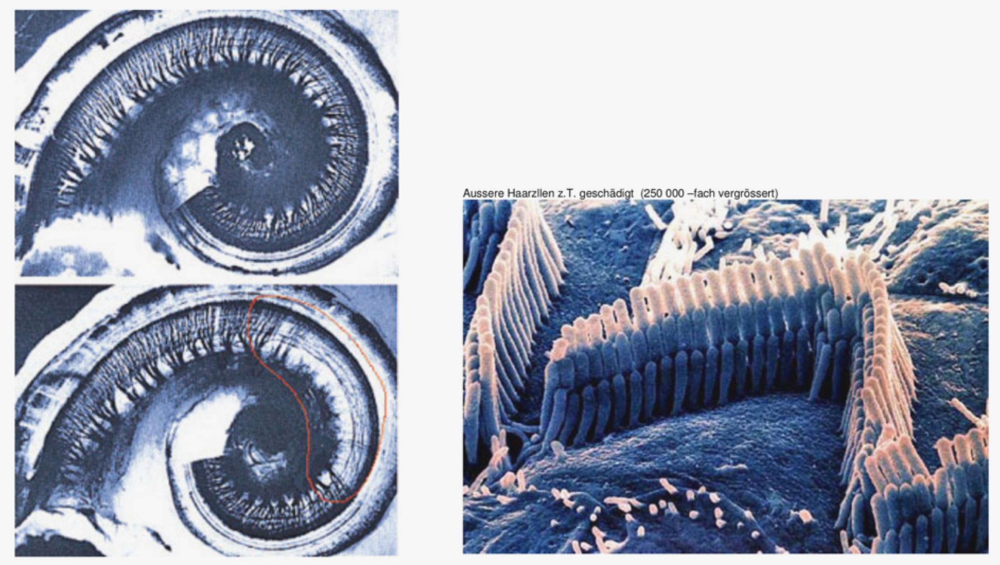

<!-- ---  
title: Theoretical Backgrounds of Audio and Graphics
author: Angela Brennecke
affiliation: Film University Babelsberg KONRAD WOLF
date: Winter term 20/21
---   -->
**Theoretical Backgrounds of Audio and Graphics - Winter term 20/21**

Prof. Dr.-Ing. Angela Brennecke | a.brennecke@filmuniversitaet.de | Film University Babelsberg *KONRAD WOLF*

---

- [Audio Rendering - Learning Objectives](#audio-rendering---learning-objectives)
- [History of Computer Music](#history-of-computer-music)
    - [Lecture Video](#lecture-video)
    - [Exercise - Computer Music](#exercise---computer-music)
- [Audio Rendering Basics](#audio-rendering-basics)
    - [Lecture Video](#lecture-video-1)
    - [Exercise - Audio Rendering](#exercise---audio-rendering)
- [Properties of Sound](#properties-of-sound)
  - [Physical and Psychophysical Aspects](#physical-and-psychophysical-aspects)
  - [Sound Generation & Propagation](#sound-generation--propagation)
    - [Longitudinal Wave](#longitudinal-wave)
    - [Transversal Wave](#transversal-wave)
    - [Sound Pressure Waves](#sound-pressure-waves)
    - [Amplitude](#amplitude)
    - [Frequency](#frequency)
    - [Complex Sounds and Timbre](#complex-sounds-and-timbre)
    - [Exercise - Sound Properties](#exercise---sound-properties)
  - [Sound Perception](#sound-perception)
    - [Hearing](#hearing)
    - [Hearing Damage](#hearing-damage)
    - [Human Hearing Range](#human-hearing-range)
    - [Amplitude and Loudness](#amplitude-and-loudness)
    - [Frequency and Pitch](#frequency-and-pitch)
    - [Exercise - Sound Perception](#exercise---sound-perception)
- [Categorization & Review](#categorization--review)
- [Homework Assignment](#homework-assignment)
  - [Theory](#theory)
  - [Categorization and Review](#categorization-and-review)
  - [Learning Check](#learning-check)
  - [Audio Editing Software](#audio-editing-software)

---

# Audio Rendering - Learning Objectives

**What?**

This lecture will start with an introduction to the course and will give you and introduction to the field of audio rendering in general following these steps:

- The historical context of computer music and digital audio.
- Introduction into audio rendering.
- Physical and psychophysical properties of sound.

**Why?**

1) **Historical Overview**: We will start with an historical overview of the development and milestones that established computer music and digital audio processing techniques.
2) **Audio rendering basics**: We will look into common audio rendering approaches so that you get a general understanding and overview of what is actually meant by audio rendering and how it is basically conducted.
3) **Properties of sound**: We will look into the complex phenomenon called *sound* and its physical and psychophysical properties. This will lay the ground works for understanding how sound creation, propagation, and perception works and what that means for digitally rendering and processing audio.


# History of Computer Music

To give you a gentle introduction into the sound and audio topics that we will cover, please checkout the video presentation on central milestones in the history of computer music:

### Lecture Video

- [Link to Computer Music History video](https://owncloud.gwdg.de/index.php/s/yTz0tkaFUGYB5BB)
- ~ 23 mins


You can find the accompanying slides in the **resources** folder. 

### Exercise - Computer Music

- What are the different areas of application and research that were presented in the screencast / what kind of application fields did you identify or are aware of other than that?

In the video on computer music history, you learned about **Musique Concrète**. Music Concrète was an essential and critical milestone from a technological as well as from an artistic point of view. It introduced a completely new approach to the process of music making by re-using, altering and adapting pre-recorded sounds. To get an even better understanding of this technique and art form, check out the following resources as well:

- [All you need to know about Musique Concrète](https://www.musicradar.com/news/everything-you-need-to-know-about-musique-concrete)
- [Pierre Schaeffer und die Musique Concrète](https://museum.rechtaufremix.org/exponate/pierre-schaeffer-und-die-musique-concrete/)

**Group work**: Music concrète will serve as the basis for our first practical exercise. Once you have completed the material above, please get in touch with your group member. Wrap your heads around the following questions and use sticky notes and this **[Miro Board](https://miro.com/app/board/o9J_kjnEj5M=/?moveToWidget=3074457350351573492&cot=12)** to answer them and add additional material, examples, questions and thoughts that we can use as a basis for a discussion: 

- What is musique concrète?
- What was so revolutionary about musique concrète?
- What do you find interesting? How could you imagine using this in an art piece?
- What is interesting from a technological point of view, what from an artistic point of view?


---

# Audio Rendering Basics

Audio rendering is a term commonly used in the context of digital sound reproduction with a special focus on the rendering process itself. In general, audio rendering targets the processing and mixing together of one ore more **sound sources** (for example, musical instruments, vocals, guitars, drums, etc.) such that an **audio image** or **soundscape** is created ready to be played back on a (specific) set of loudspeakers or headphones, the **output devices**.

### Lecture Video

To get an overview of audio rendering check out the accompanying video presentation:

- [Link to Audio Rendering video](https://owncloud.gwdg.de/index.php/s/exiSTk4dsX0yP1G)
- ~ 14 mins


### Exercise - Audio Rendering

Now check out this [**Miro Board frame**](https://miro.com/app/board/o9J_kjnEj5M=/?moveToWidget=3074457350351779224&cot=12) to work on the following questions and todos in groups of 2, every group works on one task:

- What is meant by audio rendering in general?
- What are the different audio rendering approaches? 
- *Sound reproduction* or *audio rendering*, how do you think does the meaning or intention of the terms differ?
- With this basic knowledge of the audio rendering process, try to draw a simple diagram that incorporates the following terms:
  - input source
  - output device
  - processing unit
  - analog to digital conversion
  - digital to analog conversion

--- 

# Properties of Sound

## Physical and Psychophysical Aspects

```
“If a tree falls in the forest and no one is near, does it make any sound?“ 
```

Sound is a complex physical (acoustic) and psychophysical (cognitive) phenomenon that involves an understanding of physics and of the human perception. 
Sound as a physical event is defined by how sound is generated and propagated and refers to the **physical aspects** of sound. Sound as a cognitive auditory event is defined by how sound is perceived and processed by the human brain and hearing organs and refers to the **psychophysical aspects** of sound. It is the interaction of these three aspects, **generation**, **propagation**, and **perception**, which enables us to finally hear sound. Put differently, in order to hear a sound, three aspects are needed: 

- a **sound source** that generates sound
- a **medium** through which sound can propagate
- a **listener** who perceives and hears the sound


## Sound Generation & Propagation

In order to generate sound, a vibrating object (e.g. a tuning fork) is required which causes a mechanical disturbance in a medium (e.g. air), as depicted in the following illustration: 


*Image source: https://www.physicsclassroom.com/Class/sound/tfl.gif*

The vibration of the tuning fork causes the air molecules in its closest proximity to vibrate as well. Their vibration is then transmitted to the next set of molecules in their closest proximity and so on. Hence, the inital disturbance caused by the mechanical movement of the tuning fork causes a chain reaction of smaller or larger disturbances that propagate through the medium. 

It is important to note that the molecules and vibrating objects do not start traveling. It is the energy that is generated by the initial mechanical disturbance that is propagated through the medium. 
The specific form of how this energy travels through the medium is called a **wave**. 

### Longitudinal Wave

When the direction of the vibration that creates the wave is equal to the direction of the wave propagation, i.e., in the same direction, we are talking about a **longitudinal wave**. This happens, for instance, when sound travels through air or gas: 


*Image source: https://de.wikipedia.org/wiki/Datei:Podelna_vlna.gif*

### Transversal Wave

In contrast, when the direction of vibration that creates the wave is perpendicular to the direction of the wave propagation, we are talking about a **transversal wave**. This happes, for instance, when a stone falls into the water or a rope or string vibrate:


*Image source: https://de.wikipedia.org/wiki/Datei:Pricna_vlna.gif*

**Additional Material**

- Check out this interactive [sound wave app](https://musiclab.chromeexperiments.com/Sound-Waves/) by Google experiments which depicts a waveform.
- Checkout [this website](http://digitalsoundandmusic.com/2-1-3-longitudinal-and-transverse-waves/) by digitalsoundandmusic.com on more details about longitudinal and transversal waves.
- **Question:** How does speaking work and how is sound created and transmitted when you speak? Think of the voice chords.


### Sound Pressure Waves

In our context, we will focus on longitudinal waves that exist in a gas like medium like air. 
In a physical sense, these waves are called **pressure waves** because the vibration of air molecules is actually a change of air pressure caused by an alternating sequence of compression and rarefaction, as depicted in the following image:


As you can see in the illustration, the air molecules depicted at the top of the image are either close to each other or farther away. This depends on the wave propagation and on the current level of compression or rarefaction. In general, the wave propagation and the corresponding pressure change can be described as a function of compression and rarefaction against position or over time. Sine and cosine waves serve well to represent waves mathematically. 

The image also introduces the notion of a **cycle**. A cycle represents one execution of wave propagation from equilibrium (or rest position) to maximum compression, to maximum rarefaction and back to equilibrium. The notion of a cycle is important in the context of frequency.

<!-- The image also introduces the **wavelength** which describes the distance from two conecutive wave crests or troughs. In the context of sound and audio rendering, the wavelength is an important property when it comes to room acoustics.  -->

<!-- The pressure wave is the result of a **mechanical disturbance** in the medium. Hence, to generate sound, a disturbance or **vibration** is required. This vibration might be caused by any kind of **vibrating object** like, for instance, a vibrating speaker membrane, a tuning fork, a drum beat, a slammed door, a guitar strings, or simply an oscillating air particle, to name a few.  -->

For our further considerations, however, two other properties of waves are decisive: **frequency** and **amplitude**:


### Amplitude

The amplitude A of a sound wave describes the maximum magnitude/distance of displacement of air molecules from equilibrium (rest position, no movement) either to maximum compression or to maximum rarefaction. Amplitude is always relative to equilibrium where the molecules are in rest position and do not move. This is illustrated in the next Figure:


In a psychophysical sense, amplitude is preceived as **loudness**. The larger the distance from rest position to compression or rarefaction, the louder the sound. 

**Measuring Amplitude**

In this regard, the amplitude of a sound wave is a parameter that expresses the strengths of the changes in (air) **pressure**. It can also serve as a parameter that expresses the amount of **energy** that is transmitted by the sound wave. In the former case, amplitude would usually be measured as **sound pressure level** (SPL) in Pascal (Pa). This quantifies as force per unit area or as Newton per square meter (1 Pa = 1 N/m^2). In the latter case, amplitude would be measured in the form of **sound intensity** (I) which represents the energy (or power in Watts) per unit time and unit area and is measured in Watts/m^2.

The force acting on a surface (left) or the energy passing through a specific area in time (right) is illustrated in the following two illustrations:


### Frequency

Frequency describes the rate at which the air pressure changes from compression to rarefaction per second. It is measured as **number of cycles per second** in  where **one cycle** is one sequence of an oscillation from equilibrium to pressure compression to rarefaction and back to equilibrium, as depicted in the next Figure:


In a psychophysical sense, Frequency is perceived as **pitch**. A higher frequency, i.e., a high number of cycles per second is perceived as a higher tone whereas a low frequency, i.e., a small number of cycles per second is perceived as a lower tone.

**Measuring Frequency**

Frequency is measured as **number of cycles per second in Hertz**. In the previous illustration, the left diagram depicts a frequency rate at 2 Hz, i.e., two cycles per second whereas the right diagram depicts a frequency at a rate of 4 Hz, i.e., four cycles per second.

To get an understanding of how Amplitude and Frequency are related, checkout this [interactive applet](http://musicandcomputersbook.com/applets/1_3_hear_freq.php) that allows you to change the two parameters.


### Complex Sounds and Timbre

In the real world sounds are rarely stripped down to one frequency only or purely periodic as in the examples above. Instead, sounds are complex combinations of several different frequencies. Check out the example depicted in the following image from the [musicandcomutersbook.com](http://musicandcomputersbook.com/chapter1/01_01.php):


*Image source: http://musicandcomputersbook.com/chapter1/01_01.php)*

In this context, the **timbre** of a sound is a recurring term which can be described as the color of a specific tone or even instrument. As we will see, there are different approaches to specify, analyze and to design a sound's timbre, but the complexity of sound generation, propagation and perception makes it difficult to re-create natural timbre. To find out more about the timbre, please see the section on timbre in the [musicandcomputersbook.com](http://musicandcomputersbook.com/chapter1/01_04.php).


### Exercise - Sound Properties

- **Amplitude & Frequency**: Checkout this [interactive applet](http://musicandcomputersbook.com/applets/1_3_hear_freq.php) that allows you to change the two parameters amplitude and frequency.
- **Timbre**: Checkout this [interactive applet](http://musicandcomputersbook.com/applets/1_4_draw_wave.php) that allows you to sketch out a waveform and experience different forms of "timbre".
- Checkout these two videos that illustrate the physical properties of sound:
  - [Khan Academy - Sound Properties](https://www.youtube.com/watch?time_continue=315&v=-_xZZt99MzY)
  - [Science Sauce - Sound Properties](https://www.youtube.com/watch?v=TsQL-sXZOLc)
- **Research question:** How does speaking work? 


## Sound Perception

Anything that we perceive about the physical world is referred to as psychophysical because it is related to the human organs of sensation (for exmaple eyes for seeing and ears for hearing) as well as the interpretation and processing of these sensations by the human brain. In the context of sound, a pressure wave that reaches the human ear is translated into electrochemical impulses and sent to the brain for further processing. This is illustrated in a simplified version below:


### Hearing

The human auditory system is responsible for the human hearing capabilities and can be broken down into three parts:

- the outer ear,
- the middle ear, 
- the inner ear,

as depicted in the following image:


*Image source: http://pikeslaneprimary.weebly.com/class-4aj/how-do-we-hear-sounds*


The **outer ear** is comprised of the pinna and the ear canal which form an acoustic system. The individual anatomic characteristics of the pinna help humans localize sound sources and alter the incoming sound waves slightly before they enter the ear canal. When the sound wave reaches the outer part of the eardrum, it sets the eardrum into vibration.

The **middle ear** is comprised of the inner part of the eardrum and the ossicles (malleus, incus, stapes), small bones that transmit the pressure coming from the eardrum to the inner ear in an optimal way. Imagine the middle ear as a processing unit that translates external vibration into internal vibration.

The **inner ear** is finally responsible of transforming the mechanical energy of the pressure wave into electrochemical impulses which are sent to the human brain. This is mainly carried out by the cochlea, a snail-like organ in the inner ear. The cochlea is filled with cochlear duct, a fluid which is set into motion once a sound wave reaches the inner ear. This fluid's motion interacts with the tiny little hair cells of the basilar membrane which send nerve impulses to the brain. Interestingly, the hair cells of the basilar membrane react to different frequencies depending on their position. to high frequencies the hair cells at the beginning of the membrane react, to low frequencies the hair cells at the end of the basilar membrane react, see also the following illustration:


### Hearing Damage

Hearing damage or even hearing loss can occur if you expose your ears to loud sounds for long periods of time or if you temporarily get into a situation where the pressure waves simply affect your ears too massively. In such a case it can happen that the hair cells in the basilar membrane buckle and are completely destroyed, as depicted in the following images. A processing of sound can no longer take place. Therefore, especially when working with sound, you should always make sure that all sound sources are turned down before using them (especially headphones or speakers).


*Image source: unknown*

The top left image shows a healthy membrane, bottom left shows a damged area of hair cells of the basilar membrane. The image on the right shows a set of healthy hair cells in the background and a set of damaged hair cells, in the form of the little red dots, in the front of the image.

### Human Hearing Range

As we have seen in the previous section, loudness is a psychophysical property related to the amplitude of sound pressure waves. It describes the human perception of the power or intensity of a sound wave's change in pressure. Pitch, on the other hand, is a psychophysical property related to the frequency of a sound wave. It describes how high or low humans perceive a specific sound. 

Note that not all pressure waves can be processed by the human brain as audible. Only those waves that are
within the **human hearing range** will be referred
to as audible and as such are referred to as **sound waves**. 

### Amplitude and Loudness

The **threshold of hearing** refers to the minimum audible pressure amplitude. It is measured in Pascal Pa and
ranges about 10^-5 Pa. In terms of intensity, this corresponds to a minimum intensity of about 10-12 watt per square metre. In terms of Decibel, the threshold of hearing is at 0 dB.

The **threshold of pain** refers to the maximum audible pressure amplitude. The threshold of pain is associated with pressure fluctuation shortly before damage to the hearing organs. It is over 10 Pa. This is one million times the pressure or one trillion times the intensity of the threshold of hearing. In terms of Decibel, the threshold of pain starts at ~90 dB.

- **Threshold of hearing** (silence): ~0,00001 Pa <=> 0 dB
- **Threshold of pain** (hearing damage): ~10 Pa <=>  140 dB, however hearing damage can begin at 90 dB already

These quantifications are difficult to work with in order to describe changes in loudness. Therefore, the decibel has been introduced which is a logarithmic measure to better quantify and relate air pressure changes with the human hearing range, see also the following illustration:


<!-- In both cases, the enormous dynamic range of the ear dictates that its response to changes in frequency and intensity must be nonlinear. -->

### Frequency and Pitch

Human hearing capabilities that respond to frequency range from approximately 20 Hz to 20.000 Hz (20 kHz). The higher the frequency, the higher the perceived pitch and vice versa.

- **Lowest frequencies audible by humans** ~20 Hz
- **Highest frequencies audible by humans** ~ 20 kHz

As with the preception of loudness due to changes in air pressure, the enormous dynamic range of the ear in perceiving frequencies is non-linear, too. The following illustration relates the changes in frequency with the changes in pitch: 


As you can see, the relation is in logarithmic form. This means, a linear change in pitch, i.e., from note A to the next and next next octaves of A does not correspond to a linear shift in frequencies. Rather, while pitch increases linearly, frequencies double. 

It is interesting to note that perceived loudness varies with intensity and frequency; perceived pitch varies with frequency only though. The human hearing range deacreases with increasing age.

### Exercise - Sound Perception

- **Linear vs logarithmic**: Checkout this [website and sound examples](https://www.audiocheck.net/soundtests_nonlinear.php) to actually *hear* what is meant by linear and logarithmic scales.
  - Describe the relationship in your own words.
- **Hearing range**: Checkout the following two websites that provide sound examples to test the hearing range. Please beware that the final result must not be realistic due to the general surrounding noise and your technical setup which might not playback the sampled frequencies correctly:
  - [High Frequency Range Test (8-22 kHz)](https://www.audiocheck.net/audiotests_frequencycheckhigh.php)
  - [Low Frequency Range Test (10-200 Hz)](https://www.audiocheck.net/audiotests_frequencychecklow.php)


# Categorization & Review

Now that you have learned about computer music, audio rendering, as well as sound as a physical and psychophysical phenomenon, how do you bring all of these aspects together? How do they relate in your understanding?

- Go to this [Miro frame](https://miro.com/app/board/o9J_kjnEj5M=/?moveToWidget=3074457350756164642&cot=12) and categorize the different terms and topics. Feel free to copy the frame and work with an individual setup. Try to answer the following questions:
  - What aspects belong to each topic?
  - How do the topics relate to each other in your understanding?
- Go to this [Miro frame](https://miro.com/app/board/o9J_kjnEj5M=/?moveToWidget=3074457350756113809&cot=12) and review the session according to the columns.

---

***Please Note:*** The previous sections on sound properties were restricted to the very basic concepts of sound generation and propagation through air and addressed the most essential properties of sound in order to get you started. To dive into more aspects of sound and acoustics, please checkout the recommended readings from the first page.

--- 

# Homework Assignment

## Theory 

- Recap the last sections on [Properties of Sound](#properties-of-sound) of the script including the exercises. 
- Accompany the script with the following section of the [Music and Computers Book](http://musicandcomputersbook.com)  and check out the interactive applets. 
  - [1.1 What is Sound?](http://musicandcomputersbook.com/chapter1/01_01.php)
    - Read the question at the bottom of section.
      - Do you find them relevant? 
      - Can you give answers to each of them?
  - [1.2 Amplitude and Loudness](http://musicandcomputersbook.com/chapter1/01_02.php)
  - [1.3 Frequency, Pitch, and Intervals](http://musicandcomputersbook.com/chapter1/01_03.php)
  - [1.4 Timbre](http://musicandcomputersbook.com/chapter1/01_04.php)

## Categorization and Review

If you did not have the time to finalize this task during the lecture, please go back to the [Categorization & Review](#categorization--review) section and follow the instructions. 

## Learning Check 

Please pick one of the following questions and try to answer it. Find an example to illustrate your answer if possible. Add the question you picked as well as your answer to this [Miro board](https://miro.com/app/board/o9J_kjnEj5M=/?moveToWidget=3074457350351920589&cot=10). 

If a question has already been chosen, please pick another one.

- What is the amplitude of a sound and how does it relate to the physical and psychophysical aspects of the wave?
- Why are loudnes and pitch logarithmic measures? 
- What is meant by an audio envelope? 
- What is an ADSR vs an ASR? 
- What is meant by timbre? 
  - Try to find interesting sound examples that present different timbre.
- Check out the [spectogram app](https://musiclab.chromeexperiments.com/Spectrogram/). 
  - What do you understand from the information provided by the spectogram? 
  - What is a spectogram?
  - How does timbre come into play?


## Audio Editing Software

There are many different types of audio editing software. The complexity of these software types varies strongly form simple audio recording and editing options to complex audio production and rendering functionalities. First of all, check out and explore the following audio editing software types:

- [Audacity](https://www.audacity.de)
- [Sonic Visualizer](https://www.sonicvisualiser.org)
- [Reaper](https://www.reaper.fm/index.php)

What tasks can you accomplish with these two software types? Can you imagine using them and if so why? 