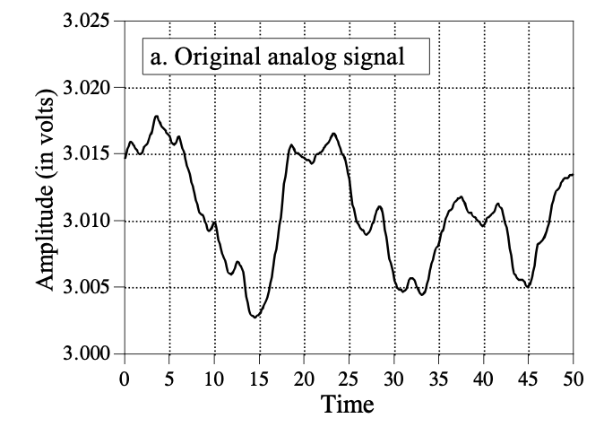
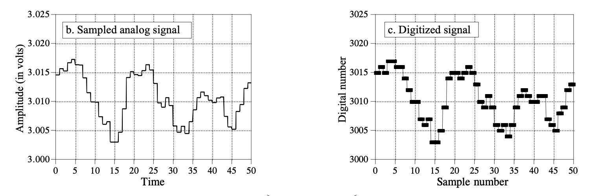
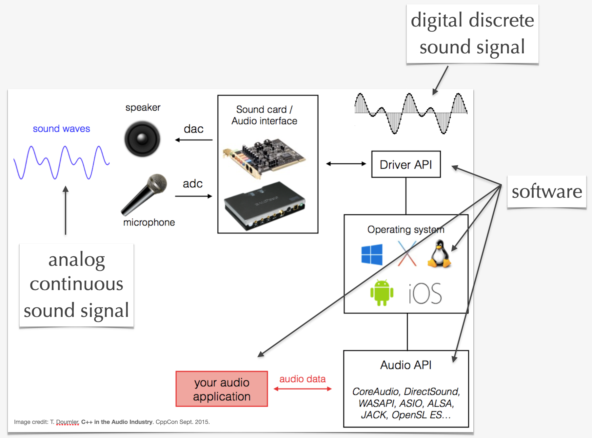
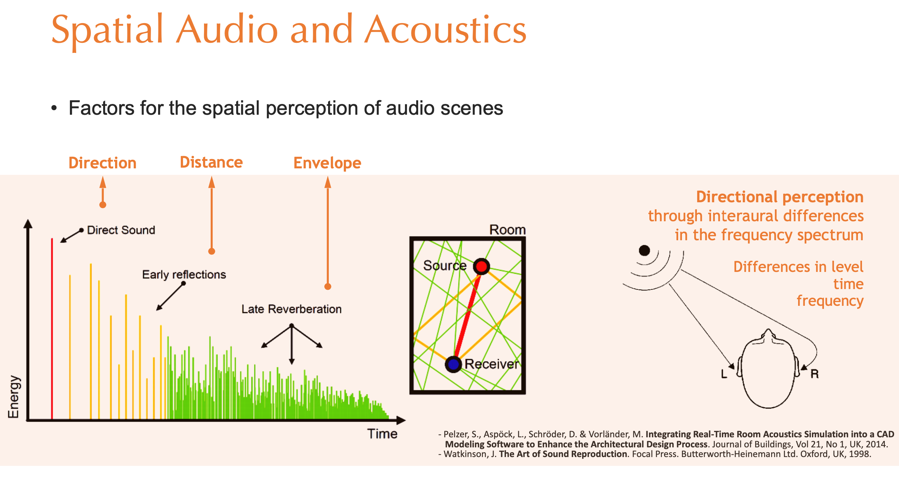
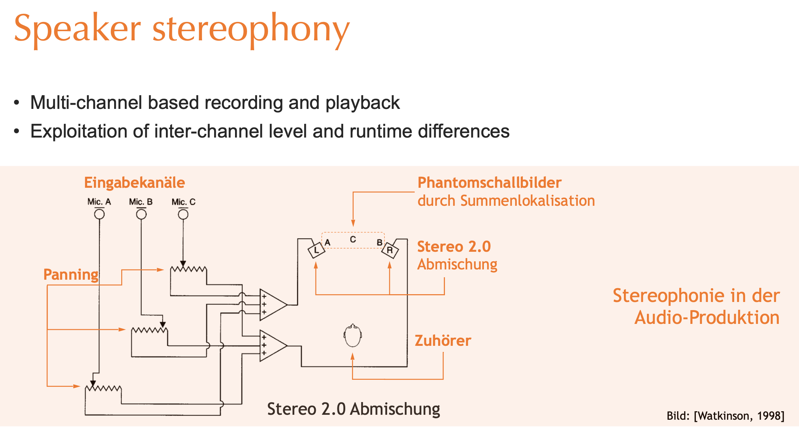

<!-- ---  
title: Theoretical Backgrounds of Audio and Graphics
author: Angela Brennecke
affiliation: Film University Babelsberg KONRAD WOLF
date: Winter term 20/21
---   -->
**Theoretical Backgrounds of Audio and Graphics - Winter term 20/21**

Prof. Dr.-Ing. Angela Brennecke | a.brennecke@filmuniversitaet.de | Film University Babelsberg *KONRAD WOLF*

---

- [Audio Production - Learning Objectives](#audio-production---learning-objectives)
- [Digital Audio and Signal Path](#digital-audio-and-signal-path)
  - [Digital Audio Signals](#digital-audio-signals)
  - [Digitization](#digitization)
    - [Self-study Material](#self-study-material)
      - [Lecture Videos](#lecture-videos)
  - [Digital Audio Signal Path](#digital-audio-signal-path)
- [Audio Production](#audio-production)
  - [Spatial Audio](#spatial-audio)
  - [Digital Audio Workstations](#digital-audio-workstations)
    - [Working with Reaper](#working-with-reaper)
  - [Dynamics, Panning, and Audio FX](#dynamics-panning-and-audio-fx)
    - [Dynamics](#dynamics)
      - [Decibel Reference Systems](#decibel-reference-systems)
      - [Decibel Sound Pressure Level](#decibel-sound-pressure-level)
      - [Decibel Full Scale](#decibel-full-scale)
    - [Panning](#panning)
      - [Lecture Video](#lecture-video)
    - [Audio FX -- Advanced](#audio-fx----advanced)
    - [Self-study Material](#self-study-material-1)
- [Additional Material](#additional-material)
- [Assignments](#assignments)
  - [Homework Assignment](#homework-assignment)
    - [Self-study](#self-study)
    - [Listen](#listen)
    - [Miro Board](#miro-board)
  - [Audio project: Musique Concrète](#audio-project-musique-concrète)
    - [Get started](#get-started)
    - [Topics](#topics)
    - [Resources](#resources)
    - [Editing](#editing)

---


# Audio Production - Learning Objectives

**What?**

In this lecture, we will cover the following topics in order to understand what an audio production is generally comprised of and how it is conducted:

- Digital audio and signal flow
- Production steps and processes
- Spatial audio in stereo
- Dynamics and audio FX

**Why?**

1) **Digital audio and signal path**: Since we are working with a computer, we first need to learn about what a "virtual sound scene" (see audio rendering from the previous section) actually looks like in terms of data files and digital signal processing. Hence, in the first part we will learn about how analog sound waves are actually represented in computer and what kind of infrastructure is needed to process them, for example, in a DAW.
2) **Production steps and process**: Next, we will look into the general steps and processes that are involved in an audio production and will particularly focus on the mixing process.
3) **Spatial audio in stereo**: One central goal of (m)any audio production is to create a spatial audio image -- at least to some extent. Stereo images are the most common way to approach spatial audio and the mixing process is targetting how to locate the different tracks (or audio objects) in the stereo image.
4) **Dynamics, panning, and audio FX**: Another central goal of (m)any audio productions is to direct the attention of the listener. Changing the dynamics or panning of the tracks is a common approach as well as adding audio FX plugins to the production.

---

# Digital Audio and Signal Path

Digital audio and digital audio technology usually refer to the processes involved in reproducing sound using audio signals that have been encoded in digital form. A little terminology will help to clarify this matter.

## Digital Audio Signals

A **signal** represents a quantity that varies over time. It could also be described as a formal description of a phenomenon evolving over time and space, for example: 
  - 1D - Sound
  - 2D - Image 
  - 3D - Movie

An **audio signal** is a representation of sound in  an analog format or a digital format:

- An **analog audio** (continuous) signal is an electronic representation of sound that can be described as a continuous function. Analog processor, for instance, would operate directly on the voltage level of the analog signal.
- A **digital audio** (discrete) signal is a binary representation of sound that can be described as a discrete function. Digital processors operate mathematically on the binary representations of the digital signal. Digital audio expresses a pressure waveform as a binary number or sequence of numbers as we will see. 
- **Signal processing** is an operation or a set of operations that modify, analyze, change the information contained in a signal. **Digital signal processors** operate on an abstract representation of a physical quantity, the digital data, not on the quantity itself.

The following images taken from Chapter 3 of the dspguide.com illustrate the different formats:



*Image source: http://www.dspguide.com/CH3.PDF*


## Digitization

In addition, the three images illustrate the process of **digitization**. That is, converting analog audio signals into digital audio data. Digitization is a process that consists of 

- **Sampling** and
- **Quantization**.

During sampling and quantization, several important terms are introduced:

- Sampling rate
- Sampling theorem (Shannon-Nyquist theorem)
- Resolution
- Bit depth / sample size
- Digitization error

### Self-study Material 

Please check out these materials to understand what happens during digitization and what the different terms mean:

- [Music Technology 101: Sampling rate and bit depth explained](https://www.youtube.com/watch?v=zC5KFnSUPNo)
- **resources/tbag_digitization.pdf**

#### Lecture Videos

```diff 
- Two lecture videos updated
```

The following video recaps and zooms in on some aspects of digitization following the lectuer slides **resources/tbag_digitization.pdf**

- [Link to Digitization video](https://owncloud.gwdg.de/index.php/s/viV4nSWjtkr9fEN)
  - ~ 24 mins


This video briefly shows you how to change sampling rate and bit depth in Reaper and talks about quantization in the context of virtual instruments and adding Midi notes to a track:
- [Link to Reaper video](https://owncloud.gwdg.de/index.php/s/CkJOgU6Ip8Hessl)
  - ~ 10 mins


Additionally, the following two videos are highly recommended to dive deeper into the process but they require additional knowledge that we are not going to address here. Nevertheless, the lectures very niceley illustrate the sampling and quantization processes:
- [The sampling theorem](https://www.youtube.com/watch?v=vrXGaFV1AmE)
- [Quantization](https://www.youtube.com/watch?v=1KBLguIXL30)


## Digital Audio Signal Path 

Check out the following image to get an idea of the audio signal path:



- Input signal path
  - audio input / microphone
  - audio interface / sound card > **digitization**
  - audio driver
  - operating system
  - audio programming sdk
  - audio application
- Output signal path
  - audio application
  - audio programming sdk
  - operating system
  - audio driver
  - audio interface / sound card
  - audio output / loudspeaker

The **microphone** and the **loudspeaker** serve as **transducers**, they convert one form of energy in another. For example, the microphone converts an **analog continuous sound signal** (mechanical energy) into volts (electrical energy) and loudspeakers convert volts (electrical energy) back in sound (mechanical energy). 

The **soundcard** or **audio interface** contains an analog-to-digital (ADC) and a digital-to-analog (DAC) converter which converts the analog continuous sound signal (electrical volts) into a **digital discrete sound signal** and vice versa.

The digitized data is then stored inside of an **audio buffer** and ready for further processing. For example, the driver API connects the specific audio hardware (soundcard or audio interface) with the **operating system**. Put differently, the driver API provides a programming interface that tells the operating system (or the audio application directly) how to exchange audio data with the audio interface.

Often additional **audio programming SDKs** are provided or used for developing audio applications. Such audio APIs provide yet another programming interface, usually across all operating systems and platforms, and connect the user **applications** with the underlying platform and hardware specifics. 


# Audio Production 

An [audio production](http://digitalsoundandmusic.com/chapters/ch8/) commonly refers to the process of creating an audio product (usually an audio file or a set of audio files) ready for playback on a dedicated playback system, in many cases this would be a stereo system. 


## Spatial Audio

One central goal of (m)any audio production is to create a spatial audio image -- at least to some extent. The stereo field is the most common way to approach spatial audio and the mixing process is targetting how to locate the different tracks (or audio objects) in this stereo field. Let us review and discuss the following two slides for this.

The first slide illustrates what properties of sound and environment affect the perception of spatiality. Apart from that the human hearing anatomy and the interaural level and time differences influence in particular the directional perception.



In an audio production, i.e., a stereo audio production, these aspects are simulated by specifying where to locate the sounds in the stereo field (panning) and how loud or soft the sounds are going to be played back.  



## Digital Audio Workstations

A software application that comprises all of these aspects is commonly referred to as digital audio workstation (DAW). Here we will use Reaper as our DAW. If you are already familiar with another DAW, please feel free to use that one. Market standard DAWs are

- Avid's [ProTools](https://www.avid.com/de/pro-tools) (mostly in the U.S.)
- Steinberg's [Cubase](https://new.steinberg.net/de/cubase/)
- Apple's [Logic](https://www.apple.com/de/logic-pro/) 

Reaper is technologically equal to the above mentioned applications but its interface could not yet compete with the market standard apps.

### Working with Reaper

To get started with Reaper, for example, checkout the first 30 minutes of this tutorial by Hop Pole Studios on Youtube:

- [Hop Pole Studio: Reaper DAW 101: The Basics Part 1](https://www.youtube.com/watch?v=JwDcTPn2dvc)

To get a good understanding of the software, checkout the [Reaper user guide](https://www.reaper.fm/userguide.php) and the additional material and tutorial resource provided via the website.

## Dynamics, Panning, and Audio FX

Dynamics and panning are essential expressive elements used to introduce spatiality to mix as well as to keep the production interesting and direct the attention of the listener. Audio effects (FX) add another level of possibilities and options.

### Dynamics

**Dynamics** is an expressive element in an audio production that addresses changes to the different track volume levels. For example, attenuating the volume level of one track and increasing the volume level of another can change the dynamics of the mix and make it more interesting.

When talking about dynamics, there are some terms that are often confused:

- **Loudness** is, like pitch, a cognitive experience of sound level.
- **Amplitude** describes the displacement of a sound wave above or below equilibrium.
- **Volume** is a measure of the amplitude of a sound wave in decibel dB. It is used to describe the loudness of the sound.
- **Gain** is a scale factor that scales the amplitude values of a sound wave signal (gain * amplitude).


#### Decibel Reference Systems 

Some notes on the decibel: Generally speaking, the volume of a sound wave is measured in decibels dB. A decibel is a logarithmic unit that relates a measured value to a reference point in a specific reference system:
- dB_reference_system = 20 * log_10 ( measured value / reference point )

#### Decibel Sound Pressure Level

Such a reference system could be **air pressure** and thus would be measured in Pascal Pa. We are then talking about **decibel sound pressure level** (**dBSPL**) which is calculated as follows:
- dBSPL = 20 * log_10 ( measured amplitude level / silence )
- 120 dBSPL = 20 * log_10 ( 10 Pa / 10^(-5) Pa ) 

As you can see, the reference point for decibel mapping to sound pressure level is 10^(-5) Pa which is the threshold of hearing or silence. So, in order to calculate the decibel value, the logarithm is taking the ratio between the measured amplitude level and silence and multiplies that with 20. In this system, 0 dBSPL refers to silence while higher values like 60, 90, or 120 dBSPL refer to increasingly loud sounds.

#### Decibel Full Scale

If we are talking about digital audio, however, this is completely different and often confusing at first. Here, the reference system is the **bit depth** of the system. This system bit depth, for instance, 16 bit, 32 bit, 64 bit, indicates how fine grained the system can represent different amplitude values. On 16 bit system, 2^16 = 65536 amplitude values could be represented. On a 32 bit system, 2^32 = 4.294.967.296 different amplitude values could be represented, etc. In this case, we are talking about **decibel full scale** (**dBFS**). Decibel full scale takes the loudest possible value as the reference point. As a consequence, in this system 0 dBFS marks the highest possible volume (without distortion):

- dB_reference_system = 20 * log_10 ( measured value / reference point )
- dBFS = 20 * log_10 ( sample level / maximum level )
- 0 dBFS = 20 * log_10 ( 65536 / 65536 )
- -6 dBFS = 20 * log_10 ( 32768 / 65536 )
- -96 dBFS = 20 * log_10 ( 1 / 65536 )

As you can see, a 16 bit system serves as a reference point. This system can at maximum represent 2^16 = 65536 different amplitude values. Here, the loudest possible decibel value starts at 0 dbFS. Everything above will result in distortion; everything below, i.e., -6dBFS, will refer to softer values. The reason for this specific decibel scale comes from the fact that every platform might support a different bit depth, i.e., 16 bit, 32 bit, 64 bit, etc. The only common value across all bit systems would then be "0". Therefore, decibel full scale system takes this common value as its reference point.

As a consequence, whenever you are working with volume and decibel values, make sure you know the reference system.

### Panning

**Panning** is an expressive element that *moves* the sound track from center position to left or right. 
This way you can position the elements in the stereo field and create width in the mix.

Center position is usually used for central and leading sounds. In pop music, vocals are usually positioned at the center. Also, you would move sound objects or tracks to the center that are becoming important or should be focused on by the listener.

The range between center and left as well as center and right can then be used to position all of the objects on your audio stage. 

By combining panning and volume changes you can already strongly affect the experience of the track and direct the attention of the listener.

#### Lecture Video

To learn about how to automate volume or pan envelopes in your mix, look into this lecture video:

- [Link to Automation in Reaper video](https://owncloud.gwdg.de/index.php/s/WdlmvPrjeg8rxRA)
- ~ 7 mins


### Audio FX -- Advanced

Audio effects can be added to one or more tracks in order to process the signals and change the signal flow. In a digital audio workstation, audio FX are usually inserted as plugins. Here, different formats or to be more precise programming interfaces exist:

- **VST** - Virtual studio technology by Steinberg; supported on MSWindows and MacOS and by most DAWs
- **AAX** (RTAS) - Avid ProTools plugin format, supported in ProTools only, both on  MSWindows and MacOS 
- **AU** - Audio Unit by Apple, supported in on MacOS
- **Cockos** - Reaper's plugin format supported in Reaper only (afaik) and both on MacOs and MSWindows

In order to create depth in your mix, i.e., move audio objects (or tracks) to the front and to the back, audio FX like reverb (reverberation) and delay can be used. Check out the following material and try to playfully investigate and involve both FX to your mix.

### Self-study Material

- [Introduction to using Audio FX](https://blog.landr.com/audio-effects-plugins-guide/)
- [How to add FX / plugins to Reaper](https://www.youtube.com/watch?v=CByHPXk3Flw)
- [Free VST Plugins](https://www.producersphere.com/best-free-delay-vst-plugins-2020/)
- Check out the FX Masterclasses on Reverb and Delay in the **resources/fx_advanced folder**


<!-- 
### Lecture Video

Please checkout the following lecture video to learn about the above mentioned terms and how they are related:

```diff
- To be updated
```
- [Link to video]()
- ~ XXX mins


You can find the accompanying slides in the **resources** folder.  -->


# Additional Material

- [Audio Signal Processing for Music Applications](https://www.coursera.org/learn/audio-signal-processing)
- [The DSP Guide](https://www.dspguide.com/pdfbook.htm) 


--- 

# Assignments 

**You can work on these tasks in a group or on your own!**

## Homework Assignment

### Self-study 

Review the script and check out the self-study materials.

### Listen

Listen, listen, listen!

Listen to music carefully. Try to identify panning and dynamic effects. Bring examples that you find interesting to the next lecture.

### Miro Board

Please use [this Miro board to collect questions, feedback and useful information](https://miro.com/app/board/o9J_kjnEjFo=/?moveToWidget=3074457351867290298&cot=12) that you have stumbled across while working on the project or reading the script:

```diff 
- Link updated!
```

The miro board also includes one frame for review and recap where I would like you to collect your thoughts so we can keep track of open issues and aspects that need our further attention :-)

## Audio project: Musique Concrète

### Get started 

This task will kick-off the first small term project. Your task will be to create one song in the style of musique conrète. To get an idea of where or how to start, check out this video: 

- [Recipe for Musique Conrète](https://www.youtube.com/watch?v=2ZpwbXDleDw)


One goal of this task is that you play around with the different audio applications on your own and try to figure out how they work and what you can do with them. Note down your findings, questions, and learnings in the Github Wiki so that everyone can learn and contribute.

The next goal is that you conduct an audio rendering and work on a piece of musique concrète. Think about one topic or scenery that interests you or that you detest. Try to come up with an auditive sound scene that you would like to create. 

- Pick a mobile recorder or your mobile phone and record some sounds, i.e., create field-recordings, or go to [freesound.org](https://freesound.org) to search for royalty free sounds that fit your idea.
- Load the recorded sounds into Audacity or Reaper and edit the recordings, try to identify interesting sounding parts, cut out parts that you do not like.
- Cut, copy, and paste the recordings and play them back forward and backwards to create and interesting track.


### Topics

First of all you may need a certain topic or source of inspiration that will serve as a basis for your composition.
You might alway want to ask yourselves these two questions when considering a specific theme:

- What does this topic sound like? 
- What kind of sounds would let me interpret this topic in the form of musique concrète?

The following topics are simply suggestions; feel free to come up with an individual topic.

- Your apartment
- Outer space
- City slickers
- Natural boundaries
- Stillness
- Fear
- Covid 19
- ...

### Resources

You can either use your mobile phone to record short sound samples, you can checkout this [sample folder](https://owncloud.gwdg.de/index.php/s/Vjfs9uYJEz5qoHV) that contains a preselection of freesound.org samples useful for creating a musique conrète, or you can go to [freesound.org ](https://freesound.org) and search for samples that you would like to integrate.

### Editing 

Make sure that you limit the number of samples to 3-5 different samples and work with them, which means:

- Start and run Reaper
- Create a new track
- Import your samples
- Edit the samples, for example, by
  - chopping off the beginning or the end
  - reversing the sample
  - shortening it
- Save the project
- Export and/or render the song into one final sound file (wav, or mp3)

Simply play around with the samples in Reaper and make use of as many Reaper tutorials and functionalities that work for you. 
