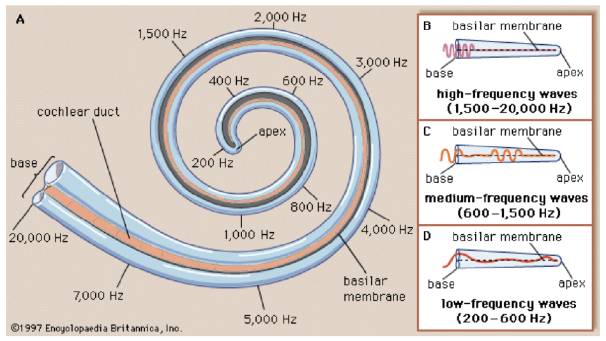

<!-- ---  
title: Theoretical Backgrounds of Audio and Graphics
author: Angela Brennecke
affiliation: Film University Babelsberg KONRAD WOLF
date: Winter term 20/21
---   -->
**Theoretical Backgrounds of Audio and Graphics - Winter term 20/21**

Prof. Dr.-Ing. Angela Brennecke | a.brennecke@filmuniversitaet.de | Film University Babelsberg *KONRAD WOLF*

---

- [Audio Basics -- Properties of Sound and Digital Audio Fundamentals](#audio-basics----properties-of-sound-and-digital-audio-fundamentals)
  - [Topics](#topics)
  - [Learning Objectives](#learning-objectives)
- [Properties of Sound](#properties-of-sound)
  - [Waves](#waves)
- [Hearing](#hearing)
  - [Psychophysical](#psychophysical)
  - [External Media](#external-media)
- [Hearing and Acoustics](#hearing-and-acoustics)
- [Digital Audio Fundamentals](#digital-audio-fundamentals)
  - [Sound vs Audio](#sound-vs-audio)
  - [Digital Audio](#digital-audio)
  - [Sampling](#sampling)
  - [## Quantization](#h2-idquantization-16quantizationh2)
- [Further Reading](#further-reading)
- [Assignments](#assignments)
  - [Historical context](#historical-context)
  - [Record and edit.](#record-and-edit)
  - [Technical stuff](#technical-stuff)

---


# Audio Basics -- Properties of Sound and Digital Audio Fundamentals


## Topics

- Properties of Sound 
- Hearing and acoustics
- Digital Audio Fundamentals 
- Applications: Recording and editing - musique concrete


## Learning Objectives

- Students will learn what is sound and what kind of properties define sound as well as how hearing works.
- Students will lean how to describe sound technically.
- Students will learn what is meant by audio and audio technology as well as how sound is processed digitally.
- Students will learn how to work with sound in a computer and apply the theory practically. 


# Properties of Sound

```
“If a tree falls in the forest and no one is near, does it make any sound?“ 
```
Sound is a complex physical & psychophysical phenomenon.

Sound in a physical sense:
A pressure wave that transmits energy through an elastic medium. Pressure wave and medium have certain measurable properties (frequency, amplitude, density of the medium, etc.,) that allow to clearly describe the sound field, the wave propagation, etc.

Sound in a psychophysical sense:
A perception (loudness, pitch, etc.) inside the mind of the listener. A sensation stimulated in the organs of hearing caused by the vibrating eardrum & interpreted by the brain as an audible sound.


A vibrating object causes a mechanical disturbance in a medium, for instance, in the air

The local disturbances propagate from one region to another

A wave is a sequence of alternating compressions & rarefactions of the particles of the medium that transfers energy through the medium / space triggered by an initial vibration

When we talk about sound it is important to understand the difference between vibrating objects causing a wave to propagate and the wave propagation itself

Vibrating objects (molecules in the air, speaker membranes, eardrums, tuning forks, guitar strings, etc.) can be expressed as a function of pressure change (amplitude) against time

A wave describes a disturbance inside a medium that propagates energy from particle to particle and moves through the medium — thus a wave can be expressed as a function of pressure change against position and time 

## Waves

Longitudinal waves  — the direction of vibration that creates the wave is equal to the direction of the wave (i.e., waves in air)

Transverse waves — the direction of vibration that creates the wave is perpendicular to the direction of the wave (i.e., light waves, waves in water, vibrating string)


# Hearing 

## Psychophysical

Anything that we perceive about the physical world
Loudness is our perception of the Power or Intensity of a sound, closely related to the Amplitude of a sound
In digital signal: loudness is computed by adding up the squares of the digital samples
If we want to know the power of a segment of audio we add up the squares of the the samples and devide by the amount of samples



Sounds interact via the eardrum with the rest of the auditory system
Eardrums work like a transducer — transform one form of energy/information into another

Human hearing (and thus what we refer to as sound) is around 20Hz to 20kHz 

Pressure changes of sound vibrations/oscillations can be produced periodically (guitar string vibration) / aperiodically (cymbal crash)

## External Media

Google experiments sound wave 
- https://musiclab.chromeexperiments.com/Sound-Waves/

Sound properties explained by
- [Khan Academy](https://www.youtube.com/watch?time_continue=315&v=-_xZZt99MzY)
- [Science Sauce](https://www.youtube.com/watch?v=TsQL-sXZOLc)

# Hearing and Acoustics


# Digital Audio Fundamentals

Digital audio is a technology that can be used to record, store, generate, manipulate, and reproduce sound using audio signals that have been encoded in digital form.(wikipedia)
what is a digital audio signal?
microphone converts sound into analog electrical signal then an ADC converts it to a digital signal then you can manipulate it (record, store, edit, modify) with digital audio tools then convert it back to analog with DAC 
Reproduction/Rendering Audio - Stereophony, 3D Audio, Binaural Audio

A transducer converts one form of energy in another
mechanical energy turns into electrical energy through a microphone (diaphragm oscillates), loudspeakers convert electrical energy back in sound
Audio refers to capture, storage & reproduction of sound
Audio equipment represents changing air pressure of sound with changing electrical voltage inside the components
Acoustical systems can be accessed with transducers, devices that change energy from one form to another 
kettledrum changes mechanical energy into acoustical energy; a microphone responds by producing electrical energy or a loudspeaker that produces acoustical energy from electrical energy

## Sound vs Audio 
Sound 
refers to a natural acoustical phenomenon

Audio
refers to audible sound i.e., the frequency range of human hearing

refers to audio signals & the (electronic) representation of sound i.e., in the contexts of sound capture, processing, reproduction

## Digital Audio

Sound waves are digitized using an audio-to-digital-converter (adc) that is part of the sound card/audio interface (device) and converted back using an digital-to-analog-converter (dac). Driver APIs provide a programming interface that tells the operating system (or the audio application directly) how to exchange audio data with the audio interface. Audio APIs introduce another layer of abstraction: They provide a programming interface across all operating systems (platforms) & are generally used by application developers.

Audio signals can be represented electronically in
analog formats: analog processors operate directly on the voltage level of the analog signal (continuous function)
digital formats: digital processors operate mathematically on the binary representations of the digital signal (discrete function)

## Sampling 

Quantization - mapping the codomain of a sampling function to a set of integer numbers
Noise (made by devices, etc.) cannot be eliminated; thus, quantization is always imprecise due to the existing noise
Digital signal processing works with countable sequences of integers so that no noise is introduced -> example is reproduction and mp3
The amplitude accuracy of a set of samples is entirely dependent on the processing HW indicated by the number of bits per sample, i.e., CD with 16 bits per sample, DVD with 24 bits per sample 

## Quantization
---

# Further Reading


--- 

# Assignments

## Historical context

Watch the video lecture *Historical notes on computer music and digital audio*. Do a little research on some of the aspects mentioned:

- Musique conrète
  - What is musique concrete?
  - Find more audio material online and pick one or two examples that you find interesting. 
  - What do you find interesting? How could you imagine using this in an art piece?
- Audio programming
  - What kind of audio programming languages were mentioned in the video lecture? 
  - Check out the different languages and try to find additional languages.
  - Pick one language and try to program some sound with it.

## Record and edit.

Download the free audio processing application *Audacity*. 

- Pick a mobile recorder or your mobile phone and record some sounds, i.e., create some field-recordings.
- Load the recorded sounds into Audacity and edit the recordings, try to identify interesting sounding parts. 
- Cut, copy, and paste the recordings and play them back forward and backwards to create and interesting track.
- Try to create musique conrete with your recording.

```diff
- Add some Audacity tutorial, tutorial on editing sounds.
```

## Technical stuff

- What are the central properties of sound? 
- Why is sound described in the form of a wave?
- How do wavelength, frequency, pitch, and amplitude relate?
- What has loudness to do with all of this?
