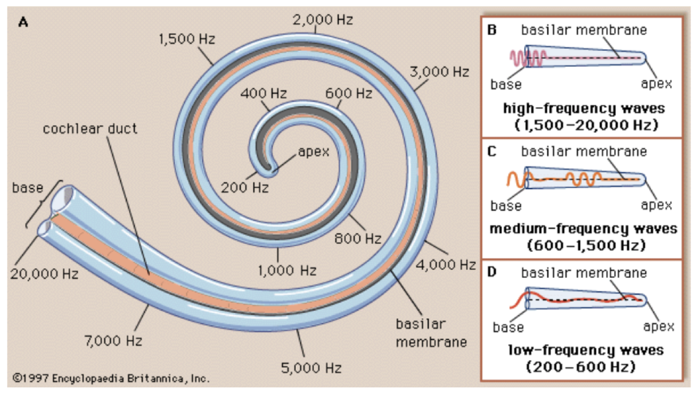

<!-- ---  
title: Theoretical Backgrounds of Audio and Graphics
author: Angela Brennecke
affiliation: Film University Babelsberg KONRAD WOLF
date: Winter term 20/21
---   -->
**Theoretical Backgrounds of Audio and Graphics - Winter term 20/21**

Prof. Dr.-Ing. Angela Brennecke | a.brennecke@filmuniversitaet.de | Film University Babelsberg *KONRAD WOLF*

---

- [Lecture Facts](#lecture-facts)
  - [Topics](#topics)
  - [Learning Objectives](#learning-objectives)
- [Audio Rendering Basics - Properties of Sound and Digital Audio Fundamentals](#audio-rendering-basics---properties-of-sound-and-digital-audio-fundamentals)
  - [Audio Rendering](#audio-rendering)
    - [Sound vs Audio](#sound-vs-audio)
    - [Digital Audio](#digital-audio)
  - [Properties of Sound](#properties-of-sound)
    - [Physical Sense](#physical-sense)
    - [Sound Waves](#sound-waves)
    - [Psychophysical Sense](#psychophysical-sense)
    - [Sound Waves](#sound-waves-1)
  - [Hearing and Acoustics](#hearing-and-acoustics)
    - [External Media](#external-media)
  - [Digital Audio Fundamentals](#digital-audio-fundamentals)
    - [Sampling](#sampling)
    - [Quantization](#quantization)
    - [Audio Buffers](#audio-buffers)
  - [Audio Editing Software](#audio-editing-software)
- [Further Reading](#further-reading)
- [Assignments](#assignments)
  - [Record and edit.](#record-and-edit)
  - [Technical stuff](#technical-stuff)

---

# Lecture Facts

## Topics 

- Audio rendering
- Properties of sound 
- Hearing and acoustics
- Digital audio fundamentals 
- Audio editing software
- Exercise and applications: musique concrete

## Learning Objectives

- What is sound and what kind of properties define sound as well as how hearing works.
- How to describe sound technically.
- What is meant by audio and audio technology as well as how sound is processed digitally.
- How to work with sound in a computer and apply the theory practically. 

---

# Audio Rendering Basics - Properties of Sound and Digital Audio Fundamentals

## Audio Rendering

Overview of audio rendering process
- analog vs digital audio signal
- basics of signal flow
- audio interfaces (I/O)
- audio processing
- audio devices

### Sound vs Audio 
Sound 
refers to a natural acoustical phenomenon

Audio
refers to audible sound i.e., the frequency range of human hearing

refers to audio signals & the (electronic) representation of sound i.e., in the contexts of sound capture, processing, reproduction

Signal represents a quantity that varies over time
Audio signal is a representation of sound 
audio signals can be represented electronically in analog & digital formats as continuous and discrete signals
digital processors operate mathematically on the binary representations of the signal
digital audio expresses the pressure waveform as a binary number

### Digital Audio

Sound waves are digitized using an audio-to-digital-converter (adc) that is part of the sound card/audio interface (device) and converted back using an digital-to-analog-converter (dac). Driver APIs provide a programming interface that tells the operating system (or the audio application directly) how to exchange audio data with the audio interface. Audio APIs introduce another layer of abstraction: They provide a programming interface across all operating systems (platforms) & are generally used by application developers.

Audio signals can be represented electronically in
analog formats: analog processors operate directly on the voltage level of the analog signal (continuous function)
digital formats: digital processors operate mathematically on the binary representations of the digital signal (discrete function)

Digital - Everything can be represented as a finite integer number

## Properties of Sound

```
“If a tree falls in the forest and no one is near, does it make any sound?“ 
```
Sound is a complex physical and psychophysical phenomenon that involves an understanding of physics as well as of the human perception and sensation. 

### Physical Sense

In a physical sense, sound is a **pressure wave** that transmits **energy** through an **elastic medium** like air or water, for example. 

### Sound Waves

The term **wave** or **pressure wave** is used to describe the sequence of alternating **compressions** and **rarefactions** of oscillating particles in the medium. 
Hence, a wave describes a disturbance inside a medium that propagates energy from particle to particle and moves through the medium. 

In this sense, a wave can be expressed as a function of pressure change against position and time.


This pressure wave is the result of a **mechanical disturbance** in the medium which is usually caused by a **vibrating object** (oscillating air particles, speaker membranes, eardrums, tuning forks, guitar strings, etc.). Phrased differently, a vibrating object causes a mechanical disturbance in a medium, for instance, in the air, and the local disturbances of the particles in the medium propagate from one region to another (see also Fig. X). 


When we talk about sound it is important to understand the difference between vibrating objects causing a wave to propagate and the wave propagation itself

Vibrating objects can be expressed as a function of pressure change (amplitude) against time


In this sense, the pressure wave and the medium have certain measurable properties that allow to (mathematically) describe the sound field, the wave propagation, etc. The measurable properties are, for example:

- **Frequency** of the wave
- **Amplitude** of the wave
- **Density** of the medium

### Psychophysical Sense

In a psychophysical or cognitive sense, sound is a **perception** inside the mind of the listener. When a sound wave reaches the eardrum, it causes the eardrum to vibrate. This stimulation propagates in, that a sensation is stimulated in the organs of hearing which is caused by the vibrating eardrum  interpreted by the brain as an audible sound.


### Sound Waves

Longitudinal waves  — the direction of vibration that creates the wave is equal to the direction of the wave (i.e., waves in air)

Transverse waves — the direction of vibration that creates the wave is perpendicular to the direction of the wave (i.e., light waves, waves in water, vibrating strings)


## Hearing and Acoustics

Anything that we perceive about the physical world
Loudness is our perception of the Power or Intensity of a sound, closely related to the Amplitude of a sound
In digital signal: loudness is computed by adding up the squares of the digital samples
If we want to know the power of a segment of audio we add up the squares of the the samples and devide by the amount of samples



Sounds interact via the eardrum with the rest of the auditory system
Eardrums work like a transducer — transform one form of energy/information into another

Human hearing (and thus what we refer to as sound) is around 20Hz to 20kHz 

Pressure changes of sound vibrations/oscillations can be produced periodically (guitar string vibration) / aperiodically (cymbal crash)

### External Media

Google experiments sound wave 
- https://musiclab.chromeexperiments.com/Sound-Waves/

Sound properties explained by
- [Khan Academy](https://www.youtube.com/watch?time_continue=315&v=-_xZZt99MzY)
- [Science Sauce](https://www.youtube.com/watch?v=TsQL-sXZOLc)


## Digital Audio Fundamentals

Digital audio and digital audio technology usually describes the process of record, store, generate, manipulate, and reproduce sound using audio signals that have been encoded in digital form.
what is a digital audio signal?
microphone converts sound into analog electrical signal then an ADC converts it to a digital signal then you can manipulate it (record, store, edit, modify) with digital audio tools then convert it back to analog with DAC 
Reproduction/Rendering Audio - Stereophony, 3D Audio, Binaural Audio

A transducer converts one form of energy in another
mechanical energy turns into electrical energy through a microphone (diaphragm oscillates), loudspeakers convert electrical energy back in sound
Audio refers to capture, storage & reproduction of sound
Audio equipment represents changing air pressure of sound with changing electrical voltage inside the components
Acoustical systems can be accessed with transducers, devices that change energy from one form to another 
kettledrum changes mechanical energy into acoustical energy; a microphone responds by producing electrical energy or a loudspeaker that produces acoustical energy from electrical energy

### Sampling 

Quantization - mapping the codomain of a sampling function to a set of integer numbers
Noise (made by devices, etc.) cannot be eliminated; thus, quantization is always imprecise due to the existing noise
Digital signal processing works with countable sequences of integers so that no noise is introduced -> example is reproduction and mp3
The amplitude accuracy of a set of samples is entirely dependent on the processing HW indicated by the number of bits per sample, i.e., CD with 16 bits per sample, DVD with 24 bits per sample 

### Quantization


### Audio Buffers


## Audio Editing Software


---

# Further Reading


--- 

# Assignments


## Record and edit.

Download the free audio processing application *Audacity*. 

- Pick a mobile recorder or your mobile phone and record some sounds, i.e., create some field-recordings.
- Load the recorded sounds into Audacity and edit the recordings, try to identify interesting sounding parts. 
- Cut, copy, and paste the recordings and play them back forward and backwards to create and interesting track.
- Try to create musique conrete with your recording.

```diff
- Add some Audacity tutorial, tutorial on editing sounds.
```

## Technical stuff

- What are the central properties of sound? 
- Why is sound described in the form of a wave?
- How do wavelength, frequency, pitch, and amplitude relate?
- What has loudness to do with all of this?
