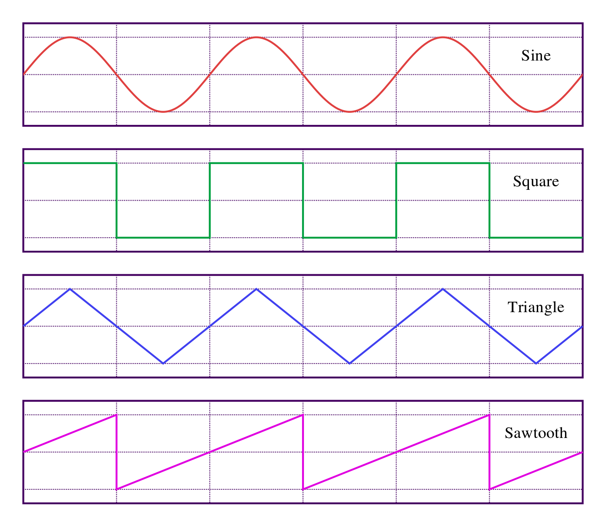
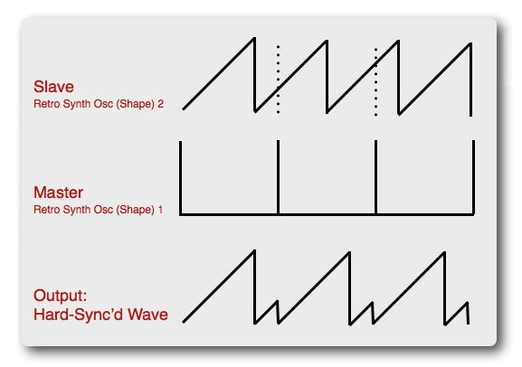
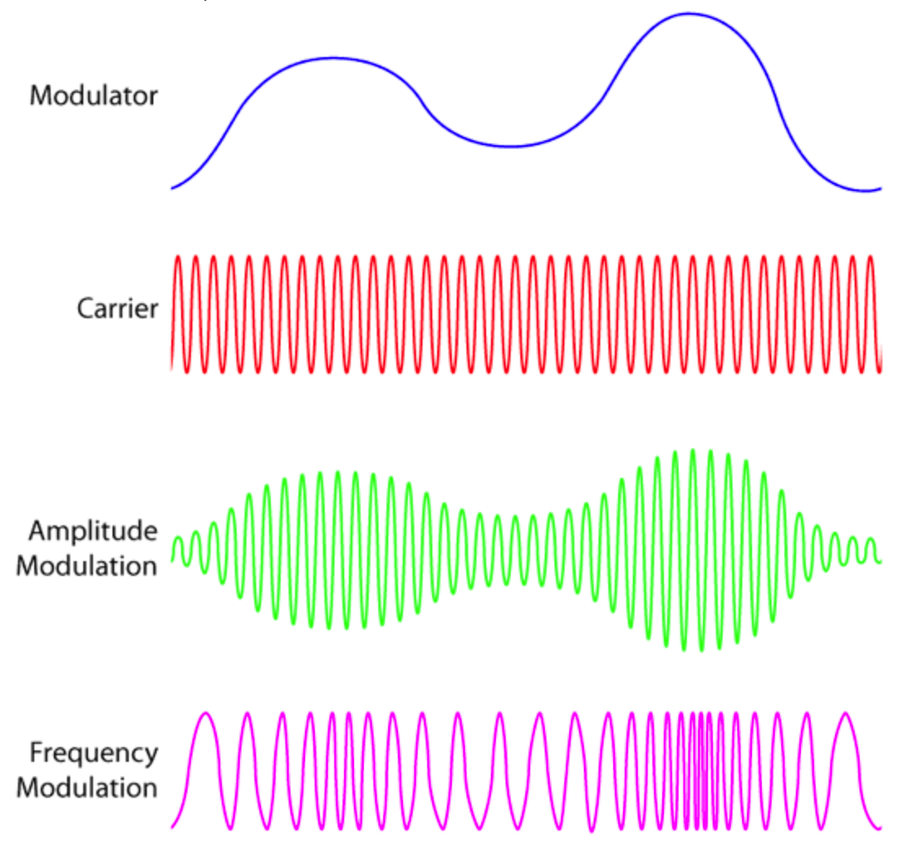

<!-- ---  
title: Theoretical Backgrounds of Audio and Graphics
author: Angela Brennecke
affiliation: Film University Babelsberg KONRAD WOLF
date: Winter term 20/21
---   -->
**Theoretical Backgrounds of Audio and Graphics - Winter term 20/21**

Prof. Dr.-Ing. Angela Brennecke | a.brennecke@filmuniversitaet.de | Film University Babelsberg *KONRAD WOLF*

---

- [Sound Synthesis - Learning Objectives](#sound-synthesis---learning-objectives)
- [Sound Generation, Synthesis, and Analysis](#sound-generation-synthesis-and-analysis)
    - [Lecture Video](#lecture-video)
    - [Additional Material](#additional-material)
  - [Practical Approches to Synthesis](#practical-approches-to-synthesis)
- [Basic Wave Types](#basic-wave-types)
    - [Sine wave](#sine-wave)
      - [Harmonic sounds](#harmonic-sounds)
      - [Inharmonic sounds](#inharmonic-sounds)
    - [Pulse or Square wave](#pulse-or-square-wave)
    - [Triangle wave](#triangle-wave)
    - [Sawtooth wave](#sawtooth-wave)
  - [Exercise](#exercise)
- [Sound Synthesis Techniques -- Advanced](#sound-synthesis-techniques----advanced)
  - [Controlling One Oscillator with Another](#controlling-one-oscillator-with-another)
  - [Sound Synthesis Sync](#sound-synthesis-sync)
  - [Amplitude Modulation (AM)](#amplitude-modulation-am)
  - [Frequency Modulation (FM)](#frequency-modulation-fm)
- [Assignments](#assignments)

---


# Sound Synthesis - Learning Objectives

1. Sound generation and basic waveforms
2. Sound synthesis
3. Anlysis and filter
4. Subtractive synthesis by example 

---

# Sound Generation, Synthesis, and Analysis

(Digital) sound synthesis describes the process of generating sound with a computer. This is usually done by creating different types of sound waves, combining them and modifying them following certain techniques and approaches (i.e., modulation, filtering, etc.). The device or application that implements all of the above mentioned steps is usually referred to as a **software synthesizer**. 

The central element of a synthesizer and at the same time the first step in the synthesis process is the **oscillator**. An oscillator is responsible for creating a digital representation of a sound wave. It is important to note that one oscillator is only capable of playing back one sound at a time. Most synthesizers thus provide numerous oscillators that are either being combined automatically or provide an interface to adjust, combine and process the individual oscillators to generate exotic and complex sounds.

To generate a single sound wave, one approach would be to use a mathematical representation of a wave and feed it into the process. Although this is not super fancy, it lays the groundwork for understanding sound synthesis. 

### Lecture Video

Check out the followin lecture video to understand the backgrounds of sound synthesis using sine waves, how these sine waves are calculated and combined and what **Fourier transform** has to do with all of this:

- [Link to Sound Synthesis video]()
- ~ 40 mins


### Additional Material

- Check out [Teropa's harmonic explorer](https://teropa.info/harmonics-explorer/) and play with the frequency and amplitude parameters. Also, add more and more simple sound waves (in this case, sine waves) together. See also how [Teropa connects frequency and pitch](https://teropa.info/blog/2016/08/10/frequency-and-pitch.html) in several examples.
- The following two links will illustrate and exemplify furthermore the mathematical representation of sinusoids:
  - https://www.geogebra.org/m/Mr5gjXmR 
  - https://jackschaedler.github.io/circles-sines-signals/sincos.html 


## Practical Approches to Synthesis

Although this is mathematically interesting, it can become computationally expensive and is hardly implemented. Instead pre-recorded sound waves are used and played back at different rates to simulate changes in pitch. These approaches are, for example, **table lookup synthesis** or **wavetable synthesis**. Here, we will however stick with pure mathematical representations in order to understand the setup of a sound wave as well as play around with computational expenses.

A special sort of oscillator is an **LFO**, a low frequency oscillator. The frequency of an LFO is usually below 20Hz and often ranges between 0.25-5Hz. LFOs are central elements of sound synthesis. Since they are below human hearing capabilities, there frequency can only be felt and is often used to modulate, i.e., change certain parameters of audible sound waves. For example, this is done to create beat or pattern-like sounds.

Once the final output of the synthesis process has been computed, it is stored in an audio or sound buffer. This buffer can then be transferred to the soundcard's DAC (digital to audio converter) where it is converted into electrical voltage changes ready to be played back by the speakers.

# Basic Wave Types

Basic oscillators usually represent the following four fundamental types of sound waves:

- Sine wave
- Pulse/square wave
- Triangle wave
- Sawtooth wave


*[Image Source: Wikipedia, last access 19/11/08](https://en.wikipedia.org/wiki/Sawtooth_wave#/media/File:Waveforms.svg)*

Following Fourier theorem, the sine wave can be used to create all of the other basic wave forms by combining different types of sine waves. The formulas will be given below per wave type. 


### Sine wave

The sine wave is the most fundamental sound wave.

```
y = A * sin ( 2 π f t )
```


**Natural sounds** can be approached by combining sine waves.

Therefore, define a fundamental frequency (a frequency that is most prominent) and add sine waves defined by multiple integers of the fundamental frequency. The resulting sounds will be perceived as **harmonic**. 

#### Harmonic sounds

```
A * sin ( 2 π f t )
+ A * sin ( 2 * 2 π f t )
+ A * sin ( 3 * 2 π f t )
+ A * sin ( 4 * 2 π f t )
...
```

In contrast, **inharmonic** sounds can be generated by combining sine waves where the overtone of the fundamental frequency are defined by non-integer multiples.


#### Inharmonic sounds

```
A * sin ( 2 π f t )
+ A * sin ( 2.453 * 2 π f t )
+ A * sin ( 1.343 * 2 π f t )
+ A * sin ( 4.56342 * 2 π f t )
...
```

### Pulse or Square wave

The pulse wave is often referred to as square wave when the duration of the positive and negative cycle is the same. 

```
A * sin ( 2 π f t  )
+ 1/3 * A * sin ( 3 * 2 π f t  )
+ 1/5 * A * sin ( 5 * 2 π f t  )
+ 1/7 * A * sin ( 7 * 2 π f t  )
...
```

### Triangle wave

The triangle wave is similar to the sine wave but lacks the smooth changes. Instead, the triangle wave can be considered a linear adaptation of the sine wave cycle.
 

```
A * cos ( 2 π f t  )
+ 1/9 * A * cos ( 3 * 2 π f t ) 
+ 1/25 * A * cos ( 5 * 2 π f t  )
+ 1/49 * A * cos ( 7 * 2 π f t ) 
...
```

### Sawtooth wave

The sawtooth wave is similar to the triangle wave but is defined by an aprubt fallback to the trough once the peak of the wave has been reached.

```
 A * sin ( 2 π f t )
- 1/2 * A * sin ( 2 * 2 π f t )
+ 1/3 * A * sin ( 3 * 2 π f t )
- 1/4 * A * sin ( 4 * 2 π f t )
...
```

## Exercise 

- Check out this video tutorial on [how to use a synthesizer, a virtual instrument plugin, to create sounds inside of Reaper](https://www.youtube.com/watch?v=lImObI2uTvs&feature=emb_title) and play with the different wave form types and combinations. Use the piano roll by inserting a midi item into your track and create a melody with your newly created sound.


# Sound Synthesis Techniques -- Advanced

## Controlling One Oscillator with Another

One aspect of sound synthesis is the generation of complex sounds by combining different waves with each other as we have seen above. Another interesting aspect of sound synthesis is the generation of complex sounds by emplyoing one oscillator as a control element. That is, one oscillator is used such that it controls certain parameters of another oscillator. For example, the LFO is often used to control another sound wave as we have already seen in the Reaper ReaSynth tutorial. 

## Sound Synthesis Sync

With sound synthesis sync a **master oscillator** controls another **slave oscillator** as illustrated in the following Image. Whenever the Master oscillator has executed one cycle of its loop, it forces the Slave to restart:


[Image Source, last access 19/11/08](https://macprovid.vo.llnwd.net/o43/hub/media/1130/10852/Fig_3.jpg)

## Amplitude Modulation (AM)

Amplitude modulation is a central and classical technique of sound synthesis. Here, a **modulator wave** is used to change the amplitude value of another **carrier wave** as illustrated in the following Image:

The oscillator employed to create the carrier wave usually creates sound at a fixed frequency rate that is much higher than the frequency of the modulator wave. Musically, AM synthesis simulates the **tremolo** effect, i.e., the emulation of a vibration by quickly changing the loudness of a sound.

To control the amplitude A1 of the carrier with the modulator's wave, the following modulation is applied to the wave forms:

- A1 = a1 * sin (2 π f1 t)
- A2 = a2 * sin (2 π f2 t)
- A1 = ( a1 + (A2) ) * sin (2 π f t)

## Frequency Modulation (FM)

Frequency modulation is another classical technique of sound synthesis. Here, instead of modulating or changing the amplitude of the carrier wave, the **modulator wave** is used to change the frequency of the **carrier wave**, as illustrated in the following Image:

As with Amplitude Modulation, the carrier wave is usually defined at a fixed frequency. Musically, FM synthesis simulates the **vibrato** effect, i.e., the emulation of a vibration by quickly changing the pitch of a sound.

To control the amplitude A1 of the carrier with the modulator's wave, the following modulation is applied to the wave forms:

- A1 = a1 * sin (2 π f1 t)
- A2 = a2 * sin (2 π f2 t)
- A1 = a1 * sin ((2 π f + A2) t)


AM and FM modulation are depicted in the following image:


[Image Source, last access 19/11/08](...)

--- 

# Assignments
 
- Check out this video tutorial on [how to use the audio FX EQ (equalizer) inside of Reaper](https://www.youtube.com/watch?v=oWiAp8sMTDg). This will show you how to adjust and change the frequency spectrum of your sounds.
- Integrate a virtual synthesizer instrument into your audio project. Try to figure out how to implement one of the synthesis techniques can be implemented with ReaSynth.