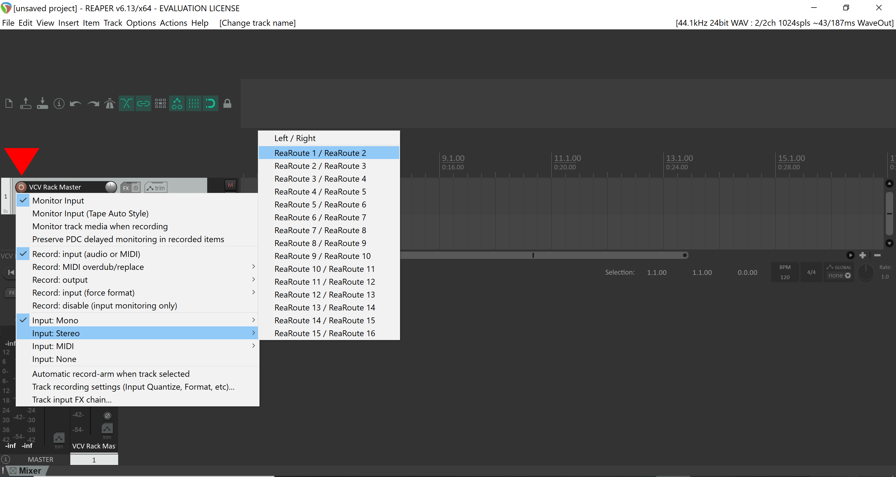
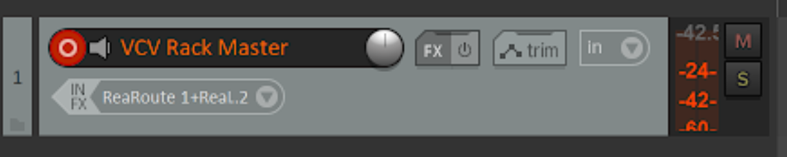

# Record Reaper with VCV Rack

_Please note, that this is recommended for **Windows** Systems only._

1. **In VCV Rack:** at Audio tab choose ReaRoute as audio device

2. **In Reaper:** create a new track (track > insert new track)

3. **In Reaper:** right click the red dot at the track and choose: Input: Stereo: ReaRoute 1/ReaRoute 2

4. **In Reaper:**  start to record 

5. **In VCV Rack:** Play a sound: either with the Keyboard, a MIDI Device or whatever setup you have. (You can create multiple tracks, too and record the different audio tracks via ReaRoute 3, 4, 5, 6, 7, 8...) 

Much fun. 