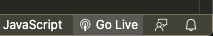

# Setup for p5.js

## Setting up Visual Studio Code

* Download and install Visual Studio Code: <https://code.visualstudio.com/Download>
* Open Visual Studio Code
* Press `ctrl` + `p` on Windows/Linux or `cmd` + `p` on MacOs
* Type `ext install samplavigne.p5-vscode` and press `Enter`.
* After a short moment, the `p5.vscode` extension has been installed.

## Creating a p5.js project

* Press `ctrl` / `cmd` + `shift` + `p`
* Type in `p5` and select `Create p5.js Project`
* In the opening file explorer create an empty folder, where you want to put your project and click on `Open`.
* A new window in VS Code opens with your initial project setup.

## Starting your p5.js project

* On the bottom right of your editor, press onto `Go Live`.

   
* Your browser opens and should present you with a grey canvas.
* Each time you change the code and save, the browser should automatically reload and show the current output.
* You can shut down the server with another click onto the previously mentioned button.

## Tipps

* If you need to install p5 addons, you can easily install them by pressing `ctrl` / `cmd` + `shift` + `p`, typing `p5` and selecting `Install p5.js Contributor Library`. Id an addon is not available, you have to install it manually. To do that, have a look at <https://p5js.org/libraries/>.
* Every time you don't have access to your setup, but want to do some prototyping, you can use the p5 online editor: <https://editor.p5js.org/>