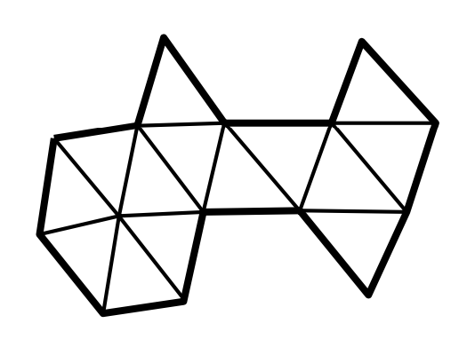
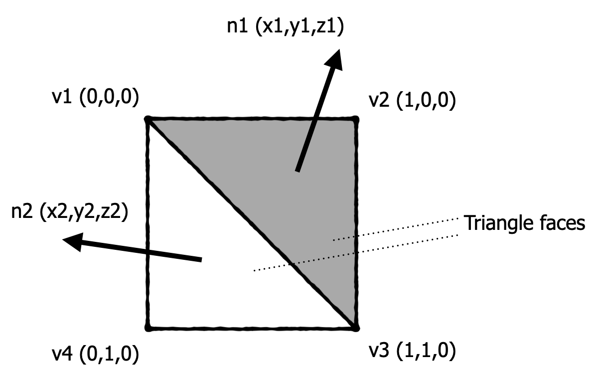
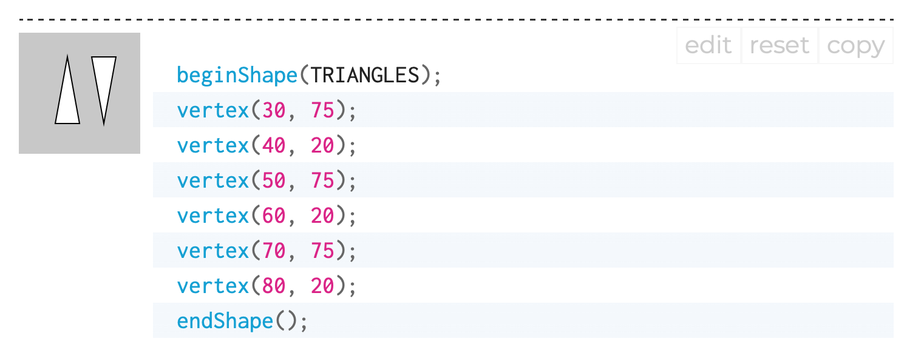
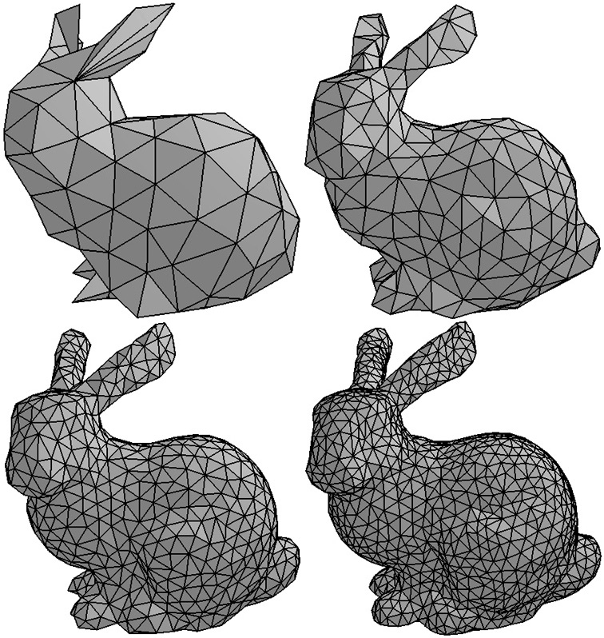
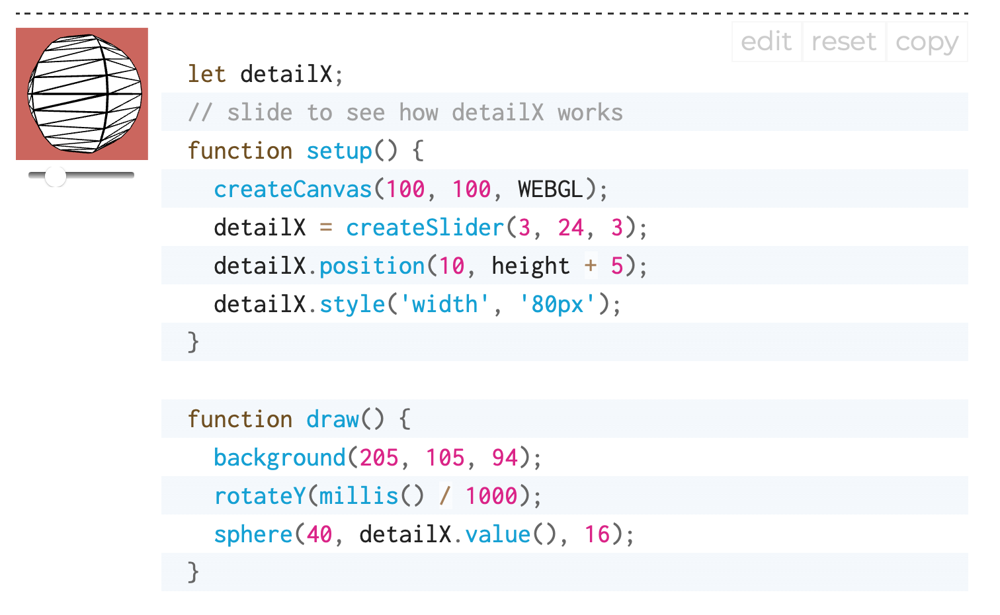
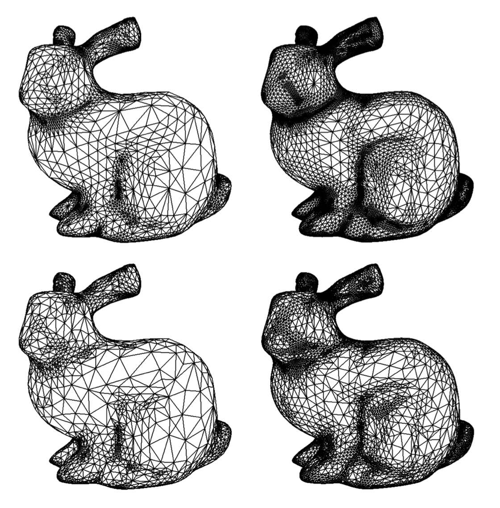
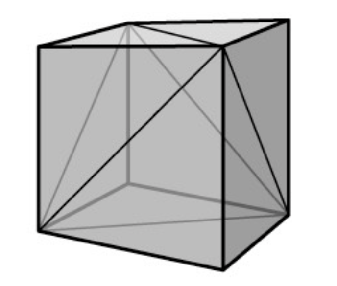
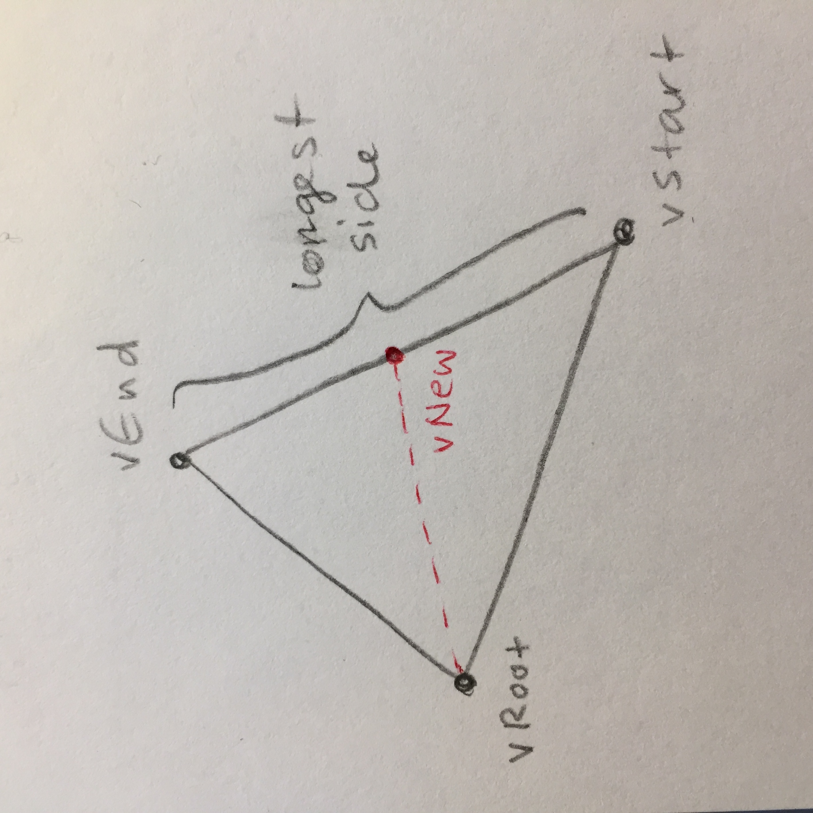

<!-- ---  
title: Theoretical Backgrounds of Audio and Graphics
author: Angela Brennecke
affiliation: Film University Babelsberg KONRAD WOLF
date: Winter term 20/21
---   -->
**Theoretical Backgrounds of Audio and Graphics - Winter term 20/21**

Prof. Dr.-Ing. Angela Brennecke | a.brennecke@filmuniversitaet.de | Film University Babelsberg *KONRAD WOLF*

---

- [Graphics Rendering - Learning Objectives](#graphics-rendering---learning-objectives)
  - [Computer Graphics History](#computer-graphics-history)
    - [Lecture Video](#lecture-video)
  - [Graphics Rendering Basics](#graphics-rendering-basics)
    - [Lecture Video](#lecture-video-1)
    - [Exercise](#exercise)
  - [Euclidian Geometry and Vertices](#euclidian-geometry-and-vertices)
    - [Lecture Video](#lecture-video-2)
    - [Additional Material](#additional-material)
  - [3D Geometric Objects and Triangles](#3d-geometric-objects-and-triangles)
    - [Terminology](#terminology)
    - [p5 / WebGL approach](#p5--webgl-approach)
    - [Examples of Polygon Meshes](#examples-of-polygon-meshes)
      - [Level of Detail](#level-of-detail)
      - [Adaptive Refinement](#adaptive-refinement)
    - [Additional Material](#additional-material-1)
    - [Implementation Details -- Advanced](#implementation-details----advanced)
      - [Vertex Buffer and Index Buffer](#vertex-buffer-and-index-buffer)
- [Assignments](#assignments)
  - [Exercises](#exercises)
    - [Script](#script)
    - [p5 Setup](#p5-setup)
    - [2D geometry and vertices](#2d-geometry-and-vertices)
      - [Exercise 1](#exercise-1)
      - [Exercise 2](#exercise-2)
    - [3D geometry and WebGL](#3d-geometry-and-webgl)
      - [Exercise 3](#exercise-3)
  - [Graphics Project](#graphics-project)
    - [Aesthetics and Geometry](#aesthetics-and-geometry)
      - [Triangle Subdivision](#triangle-subdivision)
        - [Longest Side Approach](#longest-side-approach)

---

# Graphics Rendering - Learning Objectives

**What?**

In the upcoming four lectures, we will look into selected topics from computer graphics with the intention to shed light on the general graphics rendering process. In this first lecture, we will look into the following aspects:

- Computer graphics history
- Graphics rendering basics
- Euclidian geometry and vertices
- 3D geometric objects and triangles exercises

**Why?** 

A short overview of the history of computer graphics will serve as a context for the lecture and provide you with - hopefully - interesting insights into the development of computer graphics over the last decades. Graphics rendering basics will briefly introduce the main goals of computer graphics and distinguish it from, i.e., image processing. Finally, an understanding of euclidian geometry is essential when dealing with computer graphics not only for scene and object creation but, as we will see later on, also for scene setup, object manipulation and many other aspects of graphics rendering. We will end this lecture with a couple of exercises on 3d geometric object generation and vertex manipulation.

## Computer Graphics History

### Lecture Video

The following lecture video presents you with selected milestones from computer graphics history. Check out the video presentation at the following address and the accompanying slides in the resources folder:

- [Link to CG history video](https://owncloud.gwdg.de/index.php/s/hDdzny0ezgXzEf5)
- ~ 20 mins

Please checkout in particular the video reference added to the "**VolLibre**" film. It shows you how much geometry and mathematics are interwined with computer graphics and how different subjects and/or research areas can influence each other.

<!-- ### Additional Material

Please checkout in particular the video reference added to the "VolLibre" film. It shows you how much geometry and mathematics are interwined with computer graphics and how different subjects and/or research areas can influence each other. 

- [More info on fractal geometry by 3blue1brown](https://www.3blue1brown.com/videos-blog/2017/5/26/fractals-are-typically-not-self-similar)  -->

## Graphics Rendering Basics

### Lecture Video

The following lecture video introduces you to graphics rendering in general. Check out the video presentation at the following address and the accompanying slides in the resources folder:

- [Link to graphics rendering video](https://owncloud.gwdg.de/index.php/s/LIbOXZgTRMfkoMr)
- ~ 30 mins

### Exercise

OpenGL and WebGL are based on an implementation of the rendering pipeline, hence they aim at rasterization. three.js, which is based on WebGL, also follows a rasterization approach. 

In CC1 you have implemented an interactive 3D graphics app. Check out the implementation and try to relate the steps of the rendering pipeline to the function calls you have used. 
Can you find the pipeline in your code?

## Euclidian Geometry and Vertices

### Lecture Video

The following lecture video introduces you to vector spaces and euclidian geometry in general. Check out the video presentation at the following address and the accompanying slides in the resources folder:

- [Link to vector spaces video](https://owncloud.gwdg.de/index.php/s/aCLWUc6Ci2YudFu)
- ~ 35 mins

### Additional Material

Recommended engineering approach to vectors by Daniel Shiffman:
- [Nature of Code book chapter](https://natureofcode.com/book/chapter-1-vectors/)
- [Youtube videos on vector mathematics](https://www.youtube.com/playlist?list=PLRqwX-V7Uu6ZwSmtE13iJBcoI-r4y7iEc) 

Recommended maths on vectors:

- [3blue1brown's series on linear algebra](https://www.youtube.com/playlist?list=PLZHQObOWTQDPD3MizzM2xVFitgF8hE_ab)
  - [... on vectors](https://www.youtube.com/watch?v=fNk_zzaMoSs&list=PLZHQObOWTQDPD3MizzM2xVFitgF8hE_ab&index=1)
  - [... on linear combinations and more](https://www.youtube.com/watch?v=k7RM-ot2NWY&list=PLZHQObOWTQDPD3MizzM2xVFitgF8hE_ab&index=2)

## 3D Geometric Objects and Triangles

Geometric objects are an essential part when it comes to setting up a 3D scene. In computer graphics, different representation approaches exist to describe 3D geometric objects (e.g. polygons and vertex meshes, voxel objects, or implicit surfaces that are based on implicit equations). 

Since vertex meshes and polygon representations are the common approach for describing 3d geometric objects in most real-time and interactive graphics applications or games engines, we will focus on these representations here: 

*Image source: https://tobias.isenberg.cc/graphics-intro/uploads/Class/03-3D_object_representations.pdf*

### Terminology

Important terms in this context are:

- **Triangle vertices** - Three vertices that describe to a triangle.
- **Triangle faces** - The surface that is being described by the triangle, as illustrated in the previous image.
- **Normal vector** - Each triangle face (but also every triangle vertex) can be used to calculate a normal vector, i.e., a vector that is orthogonal to the triangle face. Checkout the **cross product** to understand how normal vectors are being calculated.

In the following image, triangle vertices are represented by v1, v2, .., v4 whereas normal vectors are represented by n1 and n2:

Normal vectors are very impportant entities in computer graphics as they are heavily used during the rendering process. They tell us where the face is pointing to and thus can be used to 

<!-- 
*Image source: https://upload.wikimedia.org/wikipedia/commons/3/3c/Vertex_normals.png* -->

### p5 / WebGL approach

In order to create a mesh with p5.js, which uses WebGL API, you need to use the **beginShape** and **endShape** commands and specify how the vertices are to be connected (in this case, we want them to be connected as **TRIANGLES**). 

In p5.js, the **beginShape** and **endShape** commands (this is also true for the corresponding commands in OpenGL or WebGL) take care of the generation of the polygon 2D mesh:

*Image source: https://p5js.org/reference/#/p5/beginShape*

### Examples of Polygon Meshes

Different calculation methods for triangle subdivision have been developed and are being used. Their application often times depends on their **efficiency** in terms of rendering times and their **quality** in terms of realistic object representation. 

#### Level of Detail

A typical example for a polygon mesh at different **resolitions** or **levels of detail** of a bunny object is depicted in the following image:

*Image source: http://www.cmap.polytechnique.fr/~peyre/images/test_remeshing.jpg*

p5.js objects also allow to adjust the level of details. Check out these examples:

*Image source: https://p5js.org/reference/#/p5/sphere*

#### Adaptive Refinement

The following images illustrate an approach that referred to as **adaptive refinement** where that targets efficiencey and quality of specific object areas:

*Image source: https://www.graphics.rwth-aachen.de/media/papers/sqrt31.pdf*

Checkout the [accompanying publication](https://www.graphics.rwth-aachen.de/media/papers/sqrt31.pdf) if you are interested in the details.

### Additional Material

To learn more about meshes and triangulation in general, please refer to the following article by scratchapixel
- [scratchapixel on 3d basic rendering](https://www.scratchapixel.com/lessons/3d-basic-rendering/rendering-3d-scene-overview/rendering-3d-scene)

--- 

### Implementation Details -- Advanced

A vertex mesh is essentially a collection of vertex coordinates (vertices) that are arranged in a particular format (triangles, triangle strip) in order to describe the surface of the object. Triangle meshes use a vertex and an index buffer.

#### Vertex Buffer and Index Buffer

In order to represent a 2D or 3D object, mesh data structures (or mesh objects) take care of two things:

1. It stores 2D or 3D vertex coordinates in a vertex list called **vertex buffer**, i.e., (x,y) or (x, y, z), respectively. The vertices describe the geometric object.
2. It organizes the vertices with the help of an index list called **index buffer**. This buffer is used to arrange the vertices in a specific order, mostly in a triangular form, to describe the object's polygonal surface.

In the following illustration, a simple rectangular plane is described by four 3D vertices which are stored in a vertex buffer. The index buffer stores the arrangement of vertices reqiured to describe the triangulated mesh needed to represent the rectangle. Therefore, it stores the indices of the individual vertices. 

*Image source: https://www.e-reading-lib.com/chapter-amp.php/143437/58/andy-pike-directx-8-programming-tutorial.html*

As you can see, the first triangle is formed by the vertices 0, 1, 2 whereas the second triangle is formed by the vertices 3, 2, 1. 

The reason why two buffer lists are introduced to organize mesh representations is primarily twofold: First of all, every vertex (usually composed of 2 or 3 coordinate values) has to be stored only once. Second,  accessing and organizing indices, i.e., singular values, can be handled more efficiently. 

In OpenGL you can directly specify vertex and index buffer lists, but this is not possible for p5.js.

--- 

# Assignments

## Exercises 

### Script  

Read the script and checkout the accompanying materials and video lectures.

### p5 Setup
If you have not yet setup a working p5 dev environment, check out and follow the instructions in the code/p5_setup folder.

### 2D geometry and vertices

Check out the following p5 examples and play around with the values and parameters:

- https://p5js.org/reference/#/p5/vertex
- https://p5js.org/reference/#/p5/beginShape

Make sure you have seen the **p5.vector** reference:
- https://p5js.org/reference/#/p5.Vector

**Note:** *Take care of how you order the vertices, try to change the order and see what happens to the geometric object!*

#### Exercise 1
Pick one of the exercises from [beginShape](https://p5js.org/reference/#/p5/beginShape) or [vertex](https://p5js.org/reference/#/p5/vertex) and reimplement them using  [createVector](https://p5js.org/reference/#/p5.Vector).

#### Exercise 2

Checkout the following functions:
- https://p5js.org/reference/#/p5.Vector/dot
- https://p5js.org/reference/#/p5.Vector/cross
- https://p5js.org/reference/#/p5.Vector/lerp

What happens during each of them? Make sure you understand what is happening and create an example for each of them (pen and paper). 

### 3D geometry and WebGL

If you want to work with 3d geometry, you have to adjust the drawing context "createCanvas" such that it supports WEBGL
- https://github.com/processing/p5.js/wiki/Getting-started-with-WebGL-in-p5
- https://p5js.org/reference/#/p5/createCanvas
- https://p5js.org/reference/#/p5/sphere

#### Exercise 3 

Extend your rectangular vertex mesh from exercise 1 into 3D and create a triangle mesh that represents a box similar to the one depicted below:

*Image Source: Steve Marschner's slides on CG*

--- 

## Graphics Project

### Aesthetics and Geometry

Checkout the [instagram channel of digital artist Saskia Freeke](https://www.instagram.com/sasj_nl/?hl=de). Use it as an inspiration to create your own geometric aesthetic with p5.js. Consider the graphics project as an experiment. Try out to create interesting geometric forms and play with the maths behind that. Interactivity is not a must but would be interesting to add. 

Triangle subdivision is an example for automatically creating interesting meshes. This is going to be the basis for the graphics project.

#### Triangle Subdivision

Checkout the article [Aesthetically Pleasing Triangle Subdivision](https://tylerxhobbs.com/essays/2017/aesthetically-pleasing-triangle-subdivision) by digital artist Tyler Hobbs. 

In this article, Hobbs discusses how to create aesthetically interesting images with the help of different triangle subdivision objects. 

##### Longest Side Approach

Try to follow his approach. Start with manually describing a simple 2D object like a rectangle and subdivide it into several triangles following a specific algorithmic rule. Follow the subdivision approach depicted in the following image:

*Courtesy of Grit Kit.*

At the following links, you will find a few more ideas on how to approach triangle subdivision in case you want to experiment more:

- [Subdivision looping](https://graphics.stanford.edu/~mdfisher/subdivision.html) 
- [Triangle Subdivision](http://www.cs.cmu.edu/afs/cs/academic/class/15462-s14/www/lec_slides/Subdivision.pdf)

