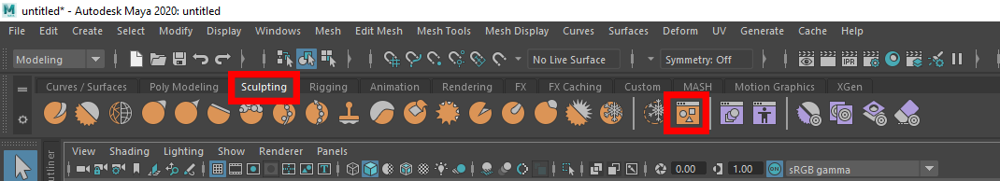
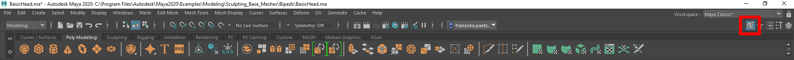
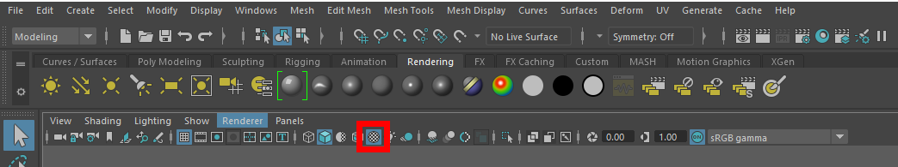

# Maya Cheat Sheet

 ## Open the Outliner

 - Windows > Outliner 

  ## Tame the View

- **Alt + Left Mouse Button**: rotate the camera around a central pivot
- **Alt + Right Mouse Button** _or_ **Alt + Scroll Middle Mouse Button**: move the camera in and out
- **Alt + Middle Mouse Button**: shifting the viewport horizontally or vertically while maintaining a constant angle of view

- **F**: focus an object

- **STRG + H**: hide an object (works in object mode)
- **Shift + H**: show hidden object (works in object mode)

- **1**: original model
- **2**: wireframe of the model you made but shows the actual mesh inside of it that has been preview smoothed
- **3**: temporary look to see how your model would look once it is smoothed s

[Maya hotkey overview](https://www.autodesk.de/shortcuts/maya)

 ## Choose Object from Content Browser

 -  Sculpting > Content Browser

 

## Show/Hide Modelling Toolkit (Multi-Cut Tool)

 

 ## Material and Textures 
 - find material tools in "Rendering" tab 
 - make sure you toggled the "Textured" button 
 
 

 ## Lightning
 - **5**: shaded display 
 - **7**: use lights 
 - **T**: adjust the direction of your liht to a fixed point 
 - find lightning tools in "Rendering"

[Lights and Shadows](http://www.3drender.com/DVD1/Lights_Shadows_notes.pdf)
