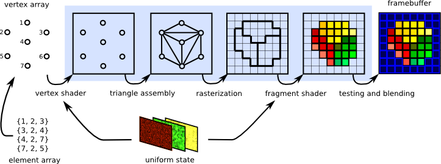
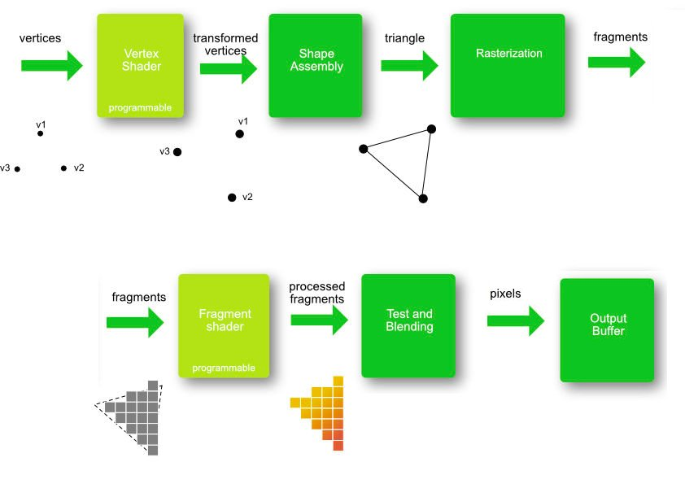

<!-- ---  
title: Theoretical Backgrounds of Audio and Graphics
author: Angela Brennecke
affiliation: Film University Babelsberg KONRAD WOLF
date: Winter term 20/21
---   -->
**Theoretical Backgrounds of Audio and Graphics - Winter term 20/21**

Prof. Dr.-Ing. Angela Brennecke | a.brennecke@filmuniversitaet.de | Film University Babelsberg *KONRAD WOLF*

---

- [Learning Objectives -- Shader Programming I](#learning-objectives----shader-programming-i)
  - [What?](#what)
  - [Why?](#why)
- [Intro to Shaders](#intro-to-shaders)
  - [Revisiting the Rendering Pipeline](#revisiting-the-rendering-pipeline)
  - [Implementation and Code Examples](#implementation-and-code-examples)
    - [Shaders, Variables, GLSL Versions](#shaders-variables-glsl-versions)
    - [Important Variables Type Qualifiers](#important-variables-type-qualifiers)
- [Additional Material](#additional-material)
- [Assignments](#assignments)
  - [1 ) Shader Exercises](#1--shader-exercises)
  - [2 ) Graphics Project](#2--graphics-project)
  - [3 ) Final Project](#3--final-project)
- [Important Dates](#important-dates)

---

# Learning Objectives -- Shader Programming I

## What?

In this session, we will start to take a first look into shader programs, what they have to do with the rendering pipeline and how they are basically functioning. The topics are as follows:

- The rendering pipeline revisited
- Vertex shaders and fragment shaders
- Uniforms and attributes
- OpenGL Shader Language

## Why?

Shader programming is a very interesting and a very powerful way to manipulate and enhance the shape and visual looks of geometric objects. At the same time, understanding how to program a shader is not that easy at first glance. It requires a basic knowledge of how computer graphics are rendered and processed in general.

<!-- ## Objects

Geometric objects are almost always defined by two groups of properties:

- **Geometric parameters** to define the object's shape 
  and to position the object in the scene.
- **Materials** to define the object's shape and looks with the help of textures or visuals (color information) or specific material properties like reflectivity, mass, elasticity, for instance.

We will focus on geometric parameters here. -->

# Intro to Shaders

"Shaders" are small programs that can be executed on the GPU on a **per-vertex** and **per-pixel** basis to speed up and further enhance the rendering and image generation process. 

Technically, a polygonal mesh is specified or loaded as a 3d model (e.g., *.obj file) in the application program. The respective vertex data and all of the corresponding vertex specifications (positions, color or texture information) are passed on to the GPU. Each vertex is then processed, rasterized and finally written into the frame buffer based on the steps specified by the rendering pipeline.

## Revisiting the Rendering Pipeline

The following illustrations present the rendering pipeline steps in a new light and indicate at which point a shader program can be used to manipulate data:

*Image source: https://www.enlightenment.org/playground/evas-gl.md*

Although the illustration was taken from the documentation of a specific graphics library called "evas-gl", the illustrated steps are universal for a rendering pipeline. 

As you can see, there are two different shader types depicted:

- **Vertex shader** to adjust and process the geometric vertex data and operate on one vertex at a time. 
  - Input: Vertex in world space
  - Output: Projected vertex position in clip space
- **Fragment shader** to adjust and process the rasterized fragment data and operate on one fragment at a time.
  - Input: Fragment
  - Output: Pixel color of the vertex

Meanwhile, there are also geometry and tesselation shader programs available but they are not yet supported on all platforms or graphics libraries. For instance, p5.js only supports vertex and fragment shader programs.

The following illustration depicts the rendering pipeline as implemented by WebGL:

*Image source: https://opentechschool-brussels.github.io/intro-to-webGL-and-shaders/log1_graphic-pipeline*

As you can see, the vertex shader will be executed first, the fragment shader will be executed subsequently. In particular, a **vertext shader** takes care of the following:

> "A vertex shader processes each vertex of the rendered object and changes its properties, such as position, normal, color, and some custom attributes. It can be used for geometric transformations of 3D objects." [Denis Perevalov, "Mastering openFrameworks", Chap. 8].

In contrast, a **fragment shader** is resonsible for finally calculating the final pixel color:

> "A fragment shader processes the color and depth of a pixel which is ready to be rendered to the screen or screen buffer. A fragment shader can be used for implementing postprocessing effects, and also for more complex image processing and generation." [Denis Perevalov, "Mastering openFrameworks", Chap. 8].

If you want to use either a vertex or a fragment shader or both in your program, you need to specify and enable both of them. openFrameworks simplifies this process with the ofShader object.

## Implementation and Code Examples 

Let's take a look at a first shader application. Check out the code folder code/shaders.

Important notes: 

- **Shader programs** are writtein in **individual source code files**. Common naming conventions are 
  - "myShader.vert" and 
  - "myShader.frag". 
- These programs are then simply **loaded into the application program** and take care of how the geometry is rendered.
- Shader programs also use their own language, for example, **OpenGL Shading Language (GLSL)** which is a C-like language.

### Shaders, Variables, GLSL Versions

When working with shaders, it is important to understand that - due to their nature as being components of the rendering pipeline - specific variables like, e.g., **gl_Vertex**, **gl_Position**, **gl_ModelViewProjectionMatrix**, **gl_FragColor**, etc., are **built-in variables** provided by the underlying OpenGL library! 

These variables are used to access and change OpenGL-specific function states although their use as fixed built-in values has been removed with latest GLSL versions. Nonetheless, older versions are widely supported on many systems which is why you should know about them. 

The list of built-in variables used by GLSL and OpenGL can be found at 
- https://www.khronos.org/registry/OpenGL-Refpages/gl4/index.php

<!-- As mentioned above, the use of the built-in variables, however, changed with latest GLSL versions. The GLSL version you can use depends on the OpenGL version supported on your system and graphics card. 
Here, we will be working with GLSL 1.2 which will work on most machines. An overview of OpenGL and GLSL versions can be found at 
- https://www.khronos.org/opengl/wiki/Core_Language_(GLSL) -->

### Important Variables Type Qualifiers

Basically, you will work with three different types of variable type qualifiers: 

- **Attributes**
  - Attribute variables are specifed and processed per vertex. They correspond to the internal OpenGL attribute settings. 
  - In p5.js, you can specify vertices by using the vertex() function. The specified values are then handed over to the underlying OpenGL library for further processing which uses its pre-defined attribute variables to store the values internally and hands those over to the shader. 
  - Examples: gl_Vertex, gl_Color, gl_MultiTexCoord0, gl_Normal, ...
- **Uniform**
  - Uniform variables can be specified in the application (i.e., sketch.js) and can be handed over to the shader program directly (compared to how attributes are processed, for instance). 
  - They are used to, for example, to hand over information interactively from the application to the shader program.
  - Uniform variables are applied to the entire primitive that is being processed.
  - Examples: User defined variables as well as dedicated OpenGL uniforms like gl_ProjectionMatrix, gl_ModelViewMatrix, gl_NormalMatrix, ...
- **Varying**
  - Varying variables can be used to exchange data between the shaders themselves; i.e., you can specify a varying variable in the vertex shader and retrieve the information inside of the fragment shader for further processing.
  - There are two sets of varying variables, one for the vertex and one for the fragment shader.
  - Examples: gl_Color, gl_TexCoord\[\], gl_FrontColor, ...
Variable type qualifiers can be used inside of your sketch.js file and be handed over to the shader programs for an execution on the GPU.

---

# Additional Material

**We will follow this p5.js tutorial**
- https://itp-xstory.github.io/p5js-shaders/#/

More information on WebGL and Shaders can be found here
- https://opentechschool-brussels.github.io/intro-to-webGL-and-shaders/log0_setting-up

For more information on the latest list of shader types supported by OpenGL and latest GLSL version specifications, visit 
- https://www.khronos.org/registry/OpenGL/specs/gl/
- https://www.khronos.org/registry/OpenGL/index_gl.php

--- 

# Assignments

## 1 ) Shader Exercises

Will be added with additional code examples by the end of this week. I just realized that the current examples are not sufficient to work with any kind of geometry. Please stay tuned. I'll send an update.

## 2 ) Graphics Project

Here, you are pretty free to come up with an idea. I can see these options:

1) Please consider the triangle subdivision tutorial from the first graphics session as a starting point to think about how an algorithm triangle subdivision could work (e.g., pen and paper) and start with a simple 2D quad geometry before you look at 3D.
2) Take the works by artist Saskia Freske as another inspirational starting point to come up with your own ideas that targets the aesthetics of geometry. Please make sure in this case, that the resulting geometry is actually defined explicitly, perhaps using an algorithmic approach, or is at least an interesting and aesthetic combination of pre-defined and custom geometric shapes.
3) Come up with an idea similar to the sketch5.js from 07 transformation. In this sketch, audio parameters are used to change the 3D geometry. You could use a clip from your soundscape together with one or more custom geometric objects.
4) Your very personal approach.

## 3 ) Final Project

I have suggested to create a "visual album"-like final documentation of the individual soundscapes combined with the graphics sketches. The final project thus targets to combine both, audio and graphics project, in one markdown (?) file ready to be published on the CTech's Github.pages.io. The challenge will be to agree on a title and potential album cover. Then everyone has to add a few sentences for their projects.

Please let me know next time if this will work for you as a group work. If not, the final project will be an individual documentation file ready to be published via Ctech's Github.pages.io.

# Important Dates

Please consider the following dates for a final meeting on the graphics projects in combination with the final documenation project:
- 15th February, 10:00 or 14:00
- 17th FEbruary, 9:30 